# Getnet Support

Multi-Agent Support Platform with RAG, Operational Data, Security Guardrails and Human Handoff

This README is available in English and Portuguese.  
Este README está disponível em inglês e português.

[English](#english) · [Português](#português)

## English

**Contents:** [Overview](#overview) · [Challenge](#challenge-requirements--implementation) · [Quick start](#quick-start) · [Configuration](#configuration-and-services) · [Build and run](#build-and-run) · [Stack](#technology-stack) · [API](#api-and-message-workflow) · [Message lifecycle](#message-lifecycle) · [LangGraph](#the-langgraph-runtime) · [Agents](#agent-contracts) · [RAG](#rag-ingestion-to-grounded-answer) · [Data](#data-architecture-and-postgresql) · [Security](#security-controls-and-audit) · [Human handoff](#human-handoff-and-concurrency) · [Testing](#testing-evaluation-and-observability) · [Decisions](#key-architecture-decisions) · [Roadmap](#roadmap-status) · [Structure](#repository-map-and-references)

### Overview

Getnet Support is a Python proof of concept for multi-agent customer assistance. A FastAPI service routes requests through a LangGraph workflow; a Django portal supplies authenticated chat, support, and administration screens. PostgreSQL stores operational facts, RAG material, audit events, and portal data. The system answers product questions from approved evidence, investigates existing operational records for authorized support staff, uses live web evidence where appropriate, and can hand a conversation to a human. The implementation is organized around the [challenge brief](docs/challenge.md).

The project does **not** execute cancellations or other business transactions. Its OPS tools read protocol, request, execution, and timeline data; a question about a cancellation protocol may require identifying which product or service the user wants to **consult**.

### Challenge Requirements & Implementation

| Challenge item | Implementation and location | Status |
| --- | --- | --- |
| Three distinct agents and explicit communication | Router, Knowledge, and Customer Support exchange typed state in the [LangGraph graph](apps/agent_api/app/agents/orchestration.py); other capabilities extend it. | Implemented |
| Router as entry point and sequence controller | [Router](apps/agent_api/app/agents/router.py) selects routes; conditional graph edges sequence agents. | Implemented |
| Product knowledge, RAG, and web search | [Knowledge Agent](apps/agent_api/app/agents/knowledge.py), [hybrid retrieval](apps/agent_api/app/rag/retrieval/hybrid.py), and [Web Knowledge Agent](apps/agent_api/app/agents/web_knowledge.py). Public ingestion uses an approved source registry; content availability depends on local publication. | Implemented; corpus must be supplied |
| Customer data and at least two tools | [Customer Support Agent](apps/agent_api/app/agents/customer_support.py) uses read-only [OPS tools](apps/agent_api/app/tools/ops.py), including protocol status and execution-failure investigation. Access requires an authorized principal. | Implemented |
| JSON HTTP endpoint | `POST /chat` in [FastAPI](apps/agent_api/app/main.py) accepts `message` and `user_id` plus optional typed context. | Implemented |
| Docker build and deployment | [Agent Dockerfile](Dockerfile), [portal Dockerfile](apps/web_portal/Dockerfile), and [Compose](docker-compose.yml). | Implemented |
| Tests and integration strategy | [Unit/contract tests](tests/), [integration tests](tests/integration/), [end-to-end tests](tests/e2e/), and Django app tests. | Implemented |
| Language and frameworks | Python 3.14+, FastAPI, Django, LangGraph, Pydantic, Psycopg, PostgreSQL/pgvector, FastEmbed; see [dependencies](pyproject.toml). | Implemented |
| Human escalation and redirect | [Human Escalation Agent](apps/agent_api/app/agents/human_escalation.py) and portal support workflow. | Implemented |
| Guardrails | Input/semantic/output security, authorization, sanitization, audit, controlled failure paths. | Implemented |
| Evaluation and observability | [Versioned datasets](evaluation/), [runners](apps/agent_api/app/evaluation/), [telemetry](apps/agent_api/app/telemetry.py), portal debugger and audit dashboard. | Implemented; published report is a historical artifact |
| Submission video | No walkthrough video is included in the repository. | External submission item |

These rows map the [core and bonus requirements](docs/challenge.md). The challenge's example prompts are represented by the [scenario suite](evaluation/challenge/scenarios-v1.yaml); outcomes depend on available evidence, authorization, and provider configuration.

#### Challenge bonus requirements

| Bonus | Implemented capability |
| --- | --- |
| Fourth agent | Deterministic Human Escalation Agent with typed transitions. |
| Guardrails | Deterministic/semantic input policy, output review and sanitized audit. |
| Redirect/handoff | Confirmation, support queue, operator ownership and suspended automation in the same conversation. |
| Evaluation/observability | Versioned RAG/challenge suites, report modules, bounded runtime traces and security dashboard. |

The Django portal, RBAC, conversation idempotency, support queue and administrative UI extend the original HTTP-agent challenge. Real customer settlement/banking integration is outside this POC; OPS demonstrates authorized inspection with synthetic operational records.

### Quick start

Prerequisites: Git, Docker Engine/Desktop with Compose v2 supporting `up --wait`, Python 3.14+ for the local helper/development commands, network access to download images/packages/embedding weights, and locally configured provider credentials. PostgreSQL 17 with pgvector 0.8.6 is enforced by the first SQL migration. For a new checkout:

```powershell
git clone https://github.com/julio7528/pocagente.git
Set-Location pocagente/getnet-support
```

Run the following from the repository root in **PowerShell**, with Docker Desktop/Compose available. Use a fresh database for the SQL initialization shown here. Do not commit `.env` or generated service credentials.

```powershell
Copy-Item .env.example .env
# Edit .env: set local POSTGRES_PASSWORD, DJANGO_SECRET_KEY, and DEEPSEEK_API_KEY.
python scripts/create_docker_service_token.py
docker compose up -d --wait postgres
$compose = docker compose config --format json | ConvertFrom-Json
$dbUser = $compose.services.postgres.environment.POSTGRES_USER
$dbName = $compose.services.postgres.environment.POSTGRES_DB
Get-ChildItem .\database\migrations\*.sql | Sort-Object Name | ForEach-Object {
    Get-Content -Raw $_.FullName | docker compose exec -T postgres psql -v ON_ERROR_STOP=1 -U $dbUser -d $dbName
    if ($LASTEXITCODE -ne 0) { throw "SQL migration failed: $($_.Name)" }
}
docker compose build
docker compose run --rm --no-deps web-portal python apps/web_portal/manage.py migrate --noinput
docker compose up -d agent-api web-portal
docker compose run --rm --no-deps web-portal python apps/web_portal/manage.py bootstrap_admin
```

The last command asks interactively for the first admin username and password. Open the portal at <http://127.0.0.1:8001/>; its login is at `/login/`, chat at `/chat/`, support at `/support/`, and admin portal at `/admin-portal/`. The Agent API is bound to <http://127.0.0.1:8000/>; `/health` checks liveness and `/ready` checks runtime readiness. The portal also has `/health/` and `/ready/`. Compose publishes all three services only on loopback. See [deployment notes](docs/specs/phase-12/11-docker-and-deployment-spec.md).

The API can be ready with an empty RAG corpus, but evidence-backed answers require publication. `knowledge/` and `reference/` were removed from Git tracking and are ignored: a fresh clone does **not** include the curated internal Markdown or public registry. Obtain approved files through the project's internal process before using the publication commands below. A configured DeepSeek key is needed for LLM-backed answers; Tavily is optional for live web search.

When enabling Tavily, supply `knowledge/internal/cancellation-process/public/sources.yaml` first: the live-web context builder loads this registry during runtime composition. A configured search provider with a missing/invalid registry can leave the API unready. With no Tavily key, the optional search capability is omitted. The fresh-clone quick start therefore assumes the template's empty Tavily key until approved source material is installed.

### Configuration and services

| Variable | Purpose | Required | Secret? |
| --- | --- | --- | --- |
| `POSTGRES_HOST`, `POSTGRES_PORT` | Database address; Compose overrides host with `postgres`. | DB access | No |
| `POSTGRES_DB`, `POSTGRES_USER` | Database and connection identity. | Yes | Configuration, not a password |
| `POSTGRES_PASSWORD` | Database authentication. | Yes | Yes |
| `POSTGRES_SSLMODE` | Driver TLS mode; template uses `disable` for local development. | Default supplied | No |
| `POSTGRES_CONNECT_TIMEOUT_SECONDS` | Connection deadline. | Default supplied | No |
| `POSTGRES_POOL_MIN_SIZE`, `POSTGRES_POOL_MAX_SIZE`, `POSTGRES_POOL_TIMEOUT_SECONDS` | Agent API pool capacity and acquisition deadline. | Defaults supplied | No |
| `DEEPSEEK_API_KEY` | LLM provider authentication. | LLM runtime | Yes |
| `DEEPSEEK_MODEL`, `DEEPSEEK_BASE_URL`, `DEEPSEEK_TIMEOUT_SECONDS` | Model selection, provider endpoint and timeout. | Defaults supplied | No |
| `TAVILY_API_KEY` | Search provider authentication. | Live web search | Yes |
| `TAVILY_BASE_URL`, `TAVILY_TIMEOUT_SECONDS` | Search endpoint and timeout. | Defaults supplied | No |
| `DJANGO_SECRET_KEY` | Signing/session security. | Portal startup | Yes |
| `DJANGO_DEBUG`, `DJANGO_ALLOWED_HOSTS` | Django diagnostics and accepted hosts; Compose forces debug off. | Defaults supplied | No |
| `WEB_PORTAL_SECURE_COOKIES` | Restrict cookies to HTTPS when deployed with TLS. | Default supplied | No |
| `PORTAL_DEBUGGER_ENABLED` | Enables portal debugger subject to its access policy. | Optional | No |
| `AGENT_API_INTERNAL_URL` | Portal-to-API address; Compose sets it automatically. | Portal agent calls | No |
| `AGENT_API_SERVICE_TOKEN` | Shared internal service credential generated by the helper. | API and portal calls | Yes |
| `AGENT_API_CONNECT_TIMEOUT_SECONDS`, `AGENT_API_READ_TIMEOUT_SECONDS` | Portal transport deadlines. | Defaults supplied | No |

The safe template is [.env.example](.env.example). Set `POSTGRES_DB`, `POSTGRES_USER`, and `POSTGRES_PASSWORD` for PostgreSQL; `DJANGO_SECRET_KEY` for the portal; `DEEPSEEK_API_KEY`, `DEEPSEEK_MODEL`, and `DEEPSEEK_BASE_URL` for the LLM; and optionally `TAVILY_API_KEY` for live search. The [token helper](scripts/create_docker_service_token.py) creates `.docker-secrets/agent-api.env` without printing the token. Compose injects it into both application services. `AGENT_API_INTERNAL_URL` is set to `http://agent-api:8000` inside Compose. Review other timeouts and portal flags in the template rather than copying real credentials into documentation.

| Service | Image/build | Port | Purpose |
| --- | --- | --- | --- |
| `postgres` | `pgvector/pgvector:0.8.6-pg17-bookworm` | `127.0.0.1:5432` | Persistent `rag`, `ops`, `audit`, and portal schemas; named data volume. |
| `agent-api` | [root Dockerfile](Dockerfile) | `127.0.0.1:8000` | FastAPI, LangGraph, providers, retrieval; named FastEmbed cache volume. |
| `web-portal` | [portal Dockerfile](apps/web_portal/Dockerfile) | `127.0.0.1:8001` | Django sessions, role-specific pages, admin, and internal API client. |

The SQL files [0001–0007](database/migrations/) initialize extensions and `rag`, `ops`, `audit`, and portal schemas; Django's `migrate` then creates portal tables. The Dockerfiles do not automatically run either migration stage. On an existing database, apply only outstanding migrations through the project's controlled database procedure; the fresh-database loop above is an initialization recipe.

For local Python development, use Python 3.14+ and install the package from [pyproject.toml](pyproject.toml):

```powershell
python -m venv .venv
.\.venv\Scripts\Activate.ps1
python -m pip install -e '.[dev]'
```

Local processes still need PostgreSQL, environment variables, migrations, and a service token. The Compose route above is the shortest complete setup. The [manual chat CLI](scripts/chat_cli.py) can call a running API or run in process; inspect `python -m scripts.chat_cli --help` for its synthetic-role options. It is a developer tool, not a replacement for portal authentication.

### Build and run

#### Docker operations

After initialization, rebuild changed applications and inspect readiness with:

```powershell
docker compose up -d --build agent-api web-portal
docker compose ps
Invoke-RestMethod http://127.0.0.1:8000/ready
Invoke-RestMethod http://127.0.0.1:8001/ready/
```

`docker compose down` stops/removes containers while retaining named volumes. A normal rebuild does not rerun SQL, seed OPS, publish RAG, or recreate the first admin. The portal and agent containers use non-root users. Compose provides internal DNS names `postgres` and `agent-api`; a browser uses the published loopback addresses, not those internal names. The portal depends on healthy PostgreSQL, but does not require the Agent API to be healthy before starting.

#### Local Agent API and Django

After editable installation, export the variables from `.env.example` into each process environment with your local values, including the same service token in both services. Creating `.env` alone does not make every entry point load it. Set `AGENT_API_INTERNAL_URL` to `http://127.0.0.1:8000` for a portal running on the host. With an initialized database, start the services in separate terminals:

```powershell
python -m uvicorn apps.agent_api.app.main:app --host 127.0.0.1 --port 8000
python -m uvicorn apps.web_portal.config.asgi:application --host 127.0.0.1 --port 8001
```

Native Windows async Psycopg requires a compatible selector event loop; use the Linux Docker services for the complete runtime on Windows. The publication CLI explicitly selects a compatible loop on Windows. The commands above are standard ASGI entry points, not an environment loader. Portal administration can also use `python -m apps.web_portal.manage migrate --noinput` and `python -m apps.web_portal.manage bootstrap_admin` from an installed/configured checkout.

#### RAG and OPS inside Docker

Compose supplies the process environment for these examples:

```powershell
docker compose exec agent-api python -m database.seed.ops.runner --validate
docker compose exec agent-api python -m database.seed.ops.runner
docker compose exec agent-api python -m apps.agent_api.app.rag.publication.cli publish-curated
docker compose exec agent-api python -m apps.agent_api.app.rag.publication.cli publish-r2-curated
docker compose exec agent-api python -m apps.agent_api.app.rag.publication.cli publish-public-registry --all
docker compose exec agent-api python -m apps.agent_api.app.rag.publication.cli smoke-test --query "cancelamento de venda" --limit 5
```

Publication requires the approved source files inside the container. The Agent Dockerfile copies the build context and does not bind-mount the host corpus: rebuilding is necessary after adding local source files to that context. Missing files must be supplied before running publication. Keep synthetic seed and integration data in a POC/disposable database.

#### Troubleshooting startup

| Symptom | Check |
| --- | --- |
| Compose reports missing env file or interpolation value | Create `.env` from the template, fill required variables, run the token helper. |
| SQL rejects version or schema already exists | Use PostgreSQL 17/pgvector 0.8.6; apply the initialization loop only to a fresh DB. |
| Portal reports missing relations or login fails after setup | Run SQL 0007 and Django migrations; create the first admin interactively. |
| API `/ready` returns 503 | Check service authentication, DB connectivity/extension, runtime dependencies and provider configuration. |
| RAG returns insufficient evidence | Confirm source files, publication, active source scope and retrieval results. |
| Live search unavailable | Configure Tavily and the approved domain/source policy. |

### Technology stack

| Layer | Technology | Responsibility |
| --- | --- | --- |
| Runtime | Python 3.14+ | Shared language for API, portal, ingestion and evaluation. |
| Browser application | Django | Sessions, CSRF, roles, ORM-managed portal tables, templates and administration. |
| Service boundary | FastAPI, Uvicorn, Pydantic | ASGI serving and strict request/response contracts. |
| Orchestration | LangGraph | Compiled graph, typed shared state and conditional transitions. |
| LLM transport | DeepSeek, HTTPX | Classification, planning, grounding and recovery through provider interfaces. |
| Live search | Tavily | Bounded current public evidence. |
| Persistence | PostgreSQL 17, Psycopg 3, psycopg-pool | Async repository access and transactional storage. |
| Retrieval | pgvector 0.8.6, PostgreSQL FTS, FastEmbed | Vector and lexical candidates, local multilingual embeddings. |
| Data tooling | PyYAML, pypdf | Structured registries/datasets and supported PDF ingestion tooling. |
| Packaging and quality | Docker Compose, pytest, Django test runner | Local deployment, contract checks and integration suites. |

Python package pins are in [pyproject.toml](pyproject.toml); the portal image has its own [dependency file](apps/web_portal/requirements-docker.txt). Database image versions come from [Compose](docker-compose.yml).

### API and message workflow

`POST /chat` accepts JSON such as `{"message":"How does Getnet Payment Link work?","user_id":"example-user"}`. Its typed response includes `status`, `route`, `reason`, and, where applicable, `answer`, `citations`, knowledge/support payloads, and human-handoff fields; see [request and response models](apps/agent_api/app/chat.py). The endpoint is an **internal service boundary**: callers need the shared bearer token and trusted identity/role headers, not merely a `user_id` in JSON. The [authentication module](apps/agent_api/app/auth.py) verifies the bearer token and `X-Authenticated-User-Id`, `X-Authenticated-Role`, and `X-Ops-Authorized` claims; clients cannot grant themselves OPS rights. The Django portal makes this call for authenticated users. Admin principals cannot use `/chat`.

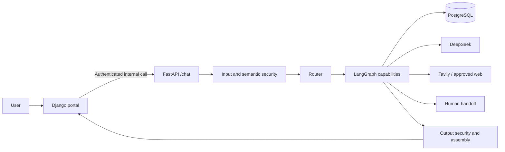

The [application service](apps/agent_api/app/chat.py) validates authorization, invokes the graph, applies recovery/output checks, and returns an allowlisted response. The portal can send a bounded conversation window and operational or human context using the optional typed fields in `ChatRequest`; the simple challenge payload remains valid. [Portal URLs](apps/web_portal/config/urls.py) expose browser workflows; [FastAPI routes](apps/agent_api/app/main.py) also expose protected debug, audit dashboard, and human-transition endpoints. `/internal/chat/debug` returns a bounded runtime trace for an authenticated service caller. Admin audit routes require an admin principal; they are not public analytics endpoints.

#### Endpoint reference

| Method and path | Access and response |
| --- | --- |
| `GET /health` | Liveness, `{"status":"ok"}`. |
| `GET /ready` | Runtime readiness, `status` and `detail`; 503 when unavailable. It is not a per-request provider quality test. |
| `POST /chat` | Trusted service plus non-admin principal; typed `ChatResponse`. |
| `POST /internal/chat/debug` | Same chat authorization; response plus bounded trace and truncation flag. |
| `GET /internal/admin/audit/summary` | Admin aggregate audit counts. |
| `GET /internal/admin/audit/recent-activity` | Admin recent activity, including the recent security window. |
| `GET /internal/admin/audit/timeseries` | Admin daily series. |
| `GET /internal/admin/audit/breakdowns` | Admin grouped audit statistics. |
| `GET /internal/admin/audit/events` | Admin paginated event list. |
| `GET /internal/admin/audit/events/{event_id}` | Admin event detail. |
| `POST /internal/human-escalation/transition` | Client confirmation or authorized support acceptance/resolution. |

Safe example request (identity headers must match the trusted caller):

```json
{"message":"Olá!","user_id":"example-user"}
```

Illustrative response shape, not a recorded execution or a fixed model answer:

```json
{
  "status": "COMPLETED",
  "route": "CONVERSATIONAL",
  "answer": "Olá! Como posso ajudar?",
  "citations": [],
  "requires_human": false,
  "reason": "BOUNDED_CONVERSATIONAL_RESPONSE"
}
```

Optional payloads can include `intent`, `knowledge`, `customer_support`, and `human`. Legacy message-only requests allow up to 4,000 characters; portal context requests have a 6,000-character current-message boundary and at most 13 context items including the current client turn. Portal conversation ID, client turn ID, and context must be supplied together. HTTP failures use `{"error":{"code":"...","message":"..."}}`; 401 means invalid authentication, 403 denied operation, 422 invalid input, and 503 unavailable runtime. A `PARTIAL` application result can still be a successful HTTP response requesting clarification.

### Message lifecycle

1. [Django views](apps/web_portal/conversations/views.py) check session, role, ownership and submitted form/turn identifiers.
2. [Conversation services](apps/web_portal/conversations/services.py) persist the client turn with an idempotency key, preventing retries from creating duplicate messages.
3. [`_prepare_turn`](apps/web_portal/conversations/agent_turns.py) locks the conversation briefly, verifies it is active and checks whether an agent response already exists.
4. The [context builder](apps/web_portal/conversations/context.py) projects a bounded window of the same conversation; historical text is data, never authorization.
5. [`AgentChatClient`](apps/web_portal/integrations/agent_chat.py) constructs the trusted internal call. The HTTP request runs outside the portal database transaction.
6. [FastAPI authentication](apps/agent_api/app/auth.py) validates the service token and trusted identity before [ChatApplicationService](apps/agent_api/app/chat.py) creates the orchestration request.
7. The graph calls Router for deterministic preflight, semantic security, intent/evidence need and capability selection. It invokes authorized tools or retrievers through typed boundaries.
8. Capability results are assembled; recovery may provide a clarification or safe fallback. Output security reviews candidate text and nested payloads before serialization.
9. Django formats safe citations and calls `append_agent_message`. That method locks and rechecks the conversation state before persisting the automatic response.
10. If a block, human handoff or closure happened while the API was processing, the automatic response is suppressed. Otherwise the message is stored once and rendered in the existing conversation.

### The LangGraph Runtime

The following is the node topology in `_build_graph`; edge predicates select the applicable path, so the drawing does not mean that every edge executes in one turn.


### LangGraph and agents

The [graph](apps/agent_api/app/agents/orchestration.py) starts at `router` and ends at `assembly`. Conditional edges may select `conversational`, `direct_general`, `knowledge`, `customer_support`, `cooperative_synthesis`, `web_knowledge`, `human_escalation`, `security_terminal`, or `ambiguous_terminal`. Knowledge can lead to OPS support or web fallback; support can lead to knowledge synthesis or handoff. Typed state carries the request, routing decision, scoped authorization, evidence, and capability results. This is sequential cooperation, not independent agents voting over an untrusted prompt.

| Capability | Responsibility and boundary |
| --- | --- |
| [Router](apps/agent_api/app/agents/router.py) | Classifies intent, evidence need, and permitted route before specialized work. |
| [Conversational](apps/agent_api/app/agents/conversational.py) | Handles greetings, clarification, and bounded general answers. Current-information needs can move to web search. |
| [Knowledge](apps/agent_api/app/agents/knowledge.py) | Retrieves approved chunks, builds grounding context, generates cited answers, and reports insufficient evidence. |
| [Customer Support](apps/agent_api/app/agents/customer_support.py) | Plans bounded read-only OPS queries, asks for missing identifiers, and separates observed facts from inference. |
| [Web Knowledge](apps/agent_api/app/agents/web_knowledge.py) | Uses live external evidence via the [Tavily adapter](apps/agent_api/app/web/tavily.py) when policy and configuration allow. |
| [Human Escalation](apps/agent_api/app/agents/human_escalation.py) | Creates/updates a structured handoff and suspends automation when an operator takes ownership. |

Example paths: a product question goes `router → knowledge → assembly` (with web fallback if approved retrieval is insufficient); an authorized protocol question goes `router → customer_support → assembly` after clarification or tool reads; a combined policy-and-case question can go `customer_support → knowledge → cooperative_synthesis`; a current external fact can go to `web_knowledge`; a user-requested agent goes to `human_escalation`. Security-blocked input terminates through `security_terminal`. Exact paths are determined by typed routing and evidence, not by these examples alone.

### Agent contracts

#### Router Agent

Input: message, bounded prior context, trusted OPS permission and optional protocol context. Output: immutable `RouterDecision` containing route, capabilities, knowledge scope, web policy and security classifications. It is invoked for each orchestration request and does not return operational records or choose unrestricted tools. See [router.py](apps/agent_api/app/agents/router.py) and [semantic routing](apps/agent_api/app/agents/semantic_routing.py).

#### Conversational Agent

Input: current question and bounded history. Output: a conversational answer, clarification, or a direct-general result indicating that current evidence is required. It handles greetings and non-retrieval conversation; the graph can transfer current-information requests to web search. It does not establish facts about a private customer account. See [conversational.py](apps/agent_api/app/agents/conversational.py).

#### Knowledge Agent

Input: `KnowledgeRequest` with question, persistent knowledge scope and context. Output: `KnowledgeResult`, answer/citations when supported, or insufficient-evidence/provider-error status. Public Getnet queries can be reformulated through [SearchQueryFormulation](apps/agent_api/app/agents/search_query_formulation.py) before hybrid retrieval. The original question remains the grounding question. Web fallback is a graph policy decision, not automatic publication or an unrestricted retry loop.

#### Customer Support Agent

Input: question, validated selectors/context and `OpsAccessContext`. Output: typed plan, selected protocol, observed facts, separate inferences, answer or clarification/unavailability outcome. It is invoked for authorized operational needs. [OperationalTools](apps/agent_api/app/tools/ops.py) exposes `lookup_protocol_status`, `inspect_execution_failure`, `investigate_protocol`, `list_recent_protocols`, `list_recent_protocols_by_execution`, and `query_analytics`. Recent-list tools accept limits 1–5. Missing identifiers or an ambiguous query can produce clarification. The current POC's OPS records are synthetic protocol/execution data, not a live merchant settlement integration.

#### Web Knowledge Agent

Input: question, knowledge scope, optional formulated query and history. Output: a `KnowledgeResult` grounded in current public search evidence. Tavily supplies bounded results; the live context builder supplies provenance/citations. `PUBLIC_GETNET` uses approved domain restrictions. Weather without location asks for the missing location. Live evidence is transient: this agent has no persistent RAG repository and does not ingest search results into `rag` tables.

#### Human Escalation Agent

Input: typed `HumanEscalationRequest` carrying state/action, conversation reference, safe package and trusted operator authority. Output: transitioned/rejected/suspended result. This capability is deterministic and has no LLM, database or queue dependency. Django owns persistent queue, assignment and transcript behavior; the state machine alone does not create a support ticket.

### Agent cooperation

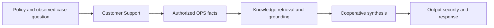

The combined route starts with support. Successful operational evidence can then be compared with process/product documentation in [orchestration](apps/agent_api/app/agents/orchestration.py). Missing facts remain missing; a written rule cannot substitute for an observed execution. The graph can return partial results or escalate when prerequisites fail.

### RAG: ingestion to grounded answer

#### 1. Ingest and approve

[Loaders](apps/agent_api/app/rag/ingestion/loader.py) accept curated internal Markdown and an approved public-source registry. [Preparation](apps/agent_api/app/rag/ingestion/service.py) validates metadata and builds chunks; the preparation CLI does not publish. [Publication](apps/agent_api/app/rag/publication/service.py) embeds and atomically publishes approved versions, recording runs. Public publication follows registry allowlisting and bounded fetching. These local source files are not part of the fresh clone.

#### 2. Store

[SQL migrations](database/migrations/0002_rag_tables.sql) define `rag.sources`, `rag.documents`, `rag.chunks`, and `rag.ingestion_runs`. Chunks carry text-search data and a 384-dimensional vector produced by [FastEmbed](apps/agent_api/app/rag/embeddings/fastembed.py), model `sentence-transformers/paraphrase-multilingual-MiniLM-L12-v2`. PostgreSQL plus pgvector is the vector store; no separate vector service is required.

#### 3. Retrieve

[Hybrid retrieval](apps/agent_api/app/rag/retrieval/hybrid.py) combines PostgreSQL lexical search and pgvector semantic search with [reciprocal rank fusion](apps/agent_api/app/rag/ranking/rrf.py). Default candidate pools are 10 lexical and 10 semantic, fused to a final top five with RRF constant 60; see [retrieval config](apps/agent_api/app/rag/config.py). Approved/active source and scope filters apply.

#### 4. Ground

The [context builder](apps/agent_api/app/rag/grounding/context_builder.py) ranks eligible evidence by provenance, creates safe citation IDs, and rejects structurally unusable evidence. Its conflict-handling instructions guide generation; the builder does not itself prove semantic consistency between documents. Internal provenance is kept distinct from the public citation view.

#### 5. Generate

The [Knowledge Agent](apps/agent_api/app/agents/knowledge.py) passes bounded evidence and citation IDs to [grounded generation](apps/agent_api/app/agents/grounded_generation.py). Unsupported or failed generation returns a controlled result rather than a fabricated source claim.


With approved local corpus and initialized DB, the publication commands are:

```powershell
python -m apps.agent_api.app.rag.ingestion.cli public-registry .\knowledge\internal\cancellation-process\public\sources.yaml
python -m apps.agent_api.app.rag.publication.cli publish-curated
python -m apps.agent_api.app.rag.publication.cli publish-r2-curated
python -m apps.agent_api.app.rag.publication.cli publish-public-registry --registry .\knowledge\internal\cancellation-process\public\sources.yaml --all
python -m apps.agent_api.app.rag.publication.cli smoke-test --query "cancelamento de venda" --limit 5
```

Run these in a configured Python environment with database access, or use the same module inside `agent-api`; the commands require their corresponding approved files and are not a no-data quick start. The public-registry preparation command only validates; publication performs network ingestion. Details: [RAG ingestion guide](docs/rag-ingestion.md).

#### Ingestion and reingestion details

The [normalizer](apps/agent_api/app/rag/ingestion/normalizer.py) produces stable content and [checksum](apps/agent_api/app/rag/ingestion/checksum.py) identifies content changes. Preparation checks source/document identity: new content is `INGEST`, changed content is `REINGEST`, unchanged content is `SKIPPED_UNCHANGED`. The [structural chunker](apps/agent_api/app/rag/ingestion/chunker.py) groups Markdown sections and labels section/business-rule/technical-symbol boundaries. Its 4,000-character safeguard splits exceptional groups at paragraphs; it is not a guaranteed tokenizer token limit. Publication embeds before making a complete document version visible and records ingestion outcomes.

#### Vector database and hybrid search

`VECTOR(384)` constrains embedding width in PostgreSQL. The semantic repository uses cosine distance; lexical retrieval uses PostgreSQL full-text search. Each candidate retains physical chunk identity and provenance. RRF adds `1 / (60 + rank)` for each channel and deduplicates by physical chunk ID; it does not average incomparable lexical and cosine scores. Final top-k is bounded before context construction.

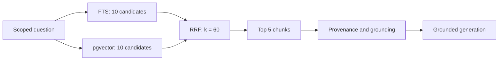

#### Grounding and generation rules

The context builder distinguishes internal process documentation (PDD/SDD, tier 1), internal technical material (tier 2), and official public material (tier 3). Source, document, chunk, section and location metadata preserve traceability. Citations for internal documents use generic labels and omit internal paths; public citations can include safe source URLs. Generation must reference supplied citation IDs and can report insufficient evidence. Citation validation and evidence sufficiency reduce unsupported output, but are not a proof that every generated statement is true; the evaluation suite measures separate retrieval, provenance and claim-support outcomes.

### OPS, LLM, and data boundaries

[OPS tables](database/migrations/0003_ops_tables.sql) model incoming email, attachments, service requests, establishments, automation runs, and execution logs. [Psycopg repositories](apps/agent_api/app/database/repositories/) expose fixed reads to [OperationalTools](apps/agent_api/app/tools/ops.py): protocol status, execution failure, recent requests/protocols, case investigation, and bounded analytics. Authorization is checked before these reads. A synthetic OPS dataset can be validated and seeded through [the seed runner](database/seed/ops/runner.py) and [seed guide](docs/ops-seed.md):

```powershell
python -m database.seed.ops.runner --validate
python -m database.seed.ops.runner
```

The second command writes sample OPS rows; use only on a database intended for the POC. It does not create real cancellation actions.

### LLM usage

[DeepSeek](apps/agent_api/app/llm/deepseek.py) supports semantic classification, operational planning, and answer generation. [Tavily](apps/agent_api/app/web/tavily.py) supplies optional current web evidence. Models do not execute arbitrary SQL: planning outputs pass typed validation, authorization, fixed repository methods, grounding, and output security. OPS observations and product rules are separate evidence classes; cooperative synthesis can join them without claiming that a general rule is a customer's observed state. The [composition root](apps/agent_api/app/composition.py) wires these dependencies.

### Data architecture and PostgreSQL

| Schema | Responsibility | Main consumers |
| --- | --- | --- |
| `rag` | Sources, documents, chunks/vectors, ingestion runs. | Publication and `RAGRepository`. |
| `ops` | `incoming_emails`, `email_attachments`, `service_requests`, `establishments`, `automation_runs`, `execution_log`. | Read-only support tools and synthetic seed. |
| `audit` | Sanitized `security_events`. | Security audit sink and admin dashboard. |
| `portal` | Django-managed users/sessions, conversations/messages and support data. | Django ORM and portal workflows. |

The [async pool](apps/agent_api/app/database/connection.py) registers pgvector per connection and owns acquisition/transaction lifecycle. [RAGRepository](apps/agent_api/app/database/repositories/rag.py), [OperationalRepository](apps/agent_api/app/database/repositories/operational.py), and [AuditRepository](apps/agent_api/app/database/repositories/audit.py) are the SQL boundaries. Agents call tools/services/retrievers which call repositories. Django uses its own ORM and portal search path; Agent API persistence uses native Psycopg. SQL migrations and Django migrations have separate responsibilities. The named PostgreSQL volume persists all four domains across normal container replacement.

### Security controls and audit

| Layer | Behavior and code |
| --- | --- |
| Input security | [Router](apps/agent_api/app/agents/router.py) applies deterministic preflight before ordinary routing. |
| Semantic security | [SemanticSecurityClassifier](apps/agent_api/app/security/semantic.py) returns a validated allow/block classification; prior conversation is untrusted context. |
| Blocking terminal | [Orchestration](apps/agent_api/app/agents/orchestration.py) stops protected routes; missing audit taxonomy or required audit availability does not permit execution. |
| Sanitization | [Sanitizer](apps/agent_api/app/security/sanitization.py) removes protected content before security persistence. |
| Output security | `OutputSecurityGate` in [semantic.py](apps/agent_api/app/security/semantic.py), applied by [chat.py](apps/agent_api/app/chat.py), controls candidate response disclosure. |
| Audit | `SecurityAuditService → PostgresSecurityAuditSink → AuditRepository → audit.security_events`. |
| Failure behavior | Invalid security decisions and failed required audit produce controlled interruption; telemetry failures are passive and do not replace the business result. |

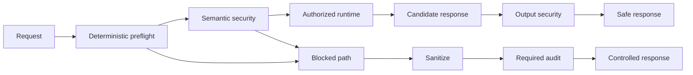

Audit is durable security/governance evidence, distinct from ordinary runtime traces. A request can produce multiple typed events persisted atomically, including timestamp, event type, source component, user/request correlation, resource category, sanitized content, action and result. Raw credentials must not be stored in audit fields. This statement concerns the audit boundary: the portal persists user conversation text, so it is not a claim that arbitrary secrets typed into chat can never exist anywhere in the database. Setup secrets belong in local environment/secret files, never the README or Git; [.gitignore](.gitignore) and [.env.example](.env.example) define the intended workflow.

### Human handoff and concurrency

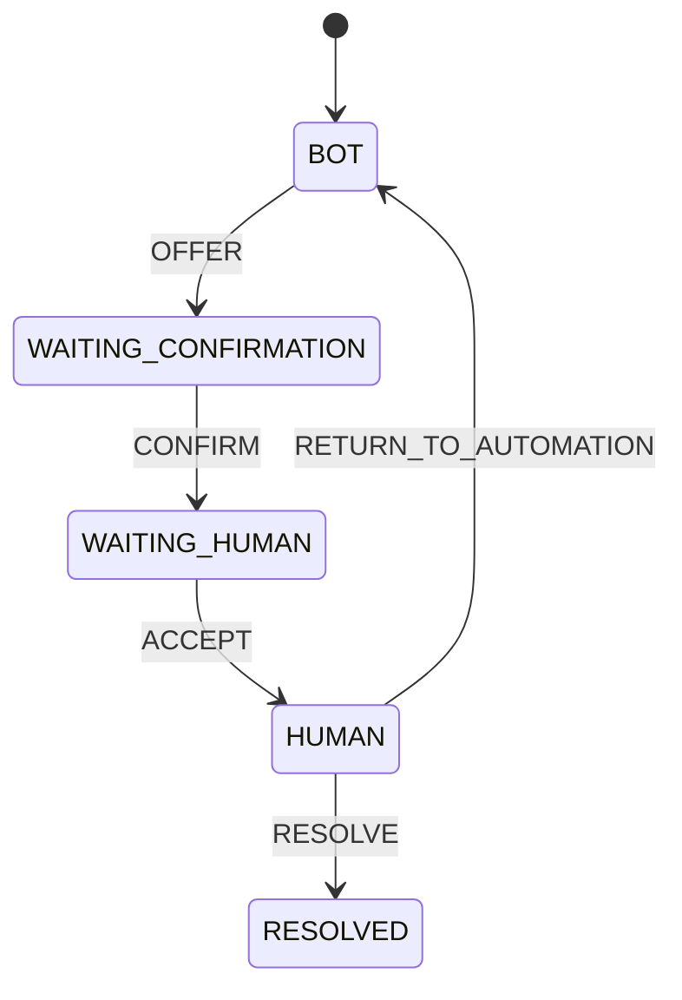

This is the domain agent's state machine. Confirmation requires an explicit user action and matching sanitized handoff package; acceptance requires a support operator. Resolution/return requires the current owner. The internal HTTP transition contract exposes `CONFIRM`, `ACCEPT`, and `RESOLVE`; the domain `RETURN_TO_AUTOMATION` action must not be mistaken for an exposed HTTP endpoint. Portal conversation statuses are a separate persistent model.

The portal applies stricter automation eligibility while queued: [agent_turns.py](apps/web_portal/conversations/agent_turns.py) suppresses late AI output when the conversation has become `WAITING_HUMAN`, `HUMAN`, `BLOCKED`, `CLOSED` or `DELETED`. [Conversation services](apps/web_portal/conversations/services.py) lock/revalidate state before insert, and [support services](apps/web_portal/support/services.py) own queue/claim actions. The external API call is not enclosed in a long DB transaction. [Concurrency tests](apps/web_portal/conversations/tests_agent_concurrency.py) cover this race. This keeps the human and bot from appending conflicting replies after ownership changes.

### Security, audit, and human handoff

[Security modules](apps/agent_api/app/security/) cover preflight and semantic input checks, sanitization, output validation, and controlled rejection. The security terminal records blocked cases through the [audit service](apps/agent_api/app/security/audit.py) into [`audit.security_events`](database/migrations/0004_audit_table.sql); if required auditing is unavailable, the graph does not silently continue. Secrets and raw sensitive payloads are excluded from the allowlisted response and bounded telemetry. The [admin dashboard service](apps/agent_api/app/security/dashboard_service.py) and [admin portal](apps/web_portal/admin_portal/) show audit summaries and events, including recent security activity. This is a defense boundary across input, tools, output, and persistence—not merely an input keyword filter.

[Human escalation](apps/agent_api/app/agents/human_escalation.py) uses explicit states and typed actions (offer, confirm, accept, resolve). The package carries a conversation reference, safe facts, inferences, timeline, and optional protocol/run references. The [internal transition route](apps/agent_api/app/main.py) accepts authorized operator actions; the [support portal](apps/web_portal/support/) manages the browser workflow. Waiting for a human does not itself claim an operator has accepted; active ownership suspends bot automation. Authentication and role checks still apply during handoff.

### Testing, evaluation, and observability

The standard Python suite is configured in [pyproject.toml](pyproject.toml):

```powershell
python -m pytest
python -m pytest tests/integration tests/e2e
python apps/web_portal/manage.py test apps.web_portal.accounts apps.web_portal.conversations apps.web_portal.support apps.web_portal.admin_portal
```

Integration tests may need configured PostgreSQL, approved corpus, and provider credentials; inspect each test's skip/setup conditions. Unit and contract tests cover routing, authorization, RAG, OPS tools, security, API, evaluation, and portal behavior. For a complete integration run, initialize a disposable DB, publish approved fixtures, seed synthetic OPS cases, exercise portal → API → graph → storage/provider paths, and verify citations, auth failures, handoff transitions, and trace redaction. No tests were run solely to author this README.

The [RAG datasets](evaluation/rag/) and [challenge scenarios](evaluation/challenge/scenarios-v1.yaml) are versioned. [RAG runner](apps/agent_api/app/evaluation/rag_runner.py), [challenge runner](apps/agent_api/app/evaluation/challenge_runner.py), [metrics](apps/agent_api/app/evaluation/metrics.py), and [reporting](apps/agent_api/app/evaluation/reporting.py) are Python modules used by tests; there is no standalone evaluation CLI in the repository. The checked-in [v1.1 report](evaluation/reports/phase11-evaluation-v1.1.json) records a historical local run of 27 RAG cases (24 pass, 2 fail, 1 not measurable) and 14 passing challenge scenarios. These are not claims about a fresh clone or this README update. Relevant reproducible tests include `python -m pytest tests/test_rag_evaluation_runner.py tests/test_challenge_evaluation_runner.py tests/test_evaluation_metrics_reporting.py` and, with integration prerequisites, `python -m pytest tests/integration/test_rag_evaluation_runner_real.py tests/e2e/test_phase11_challenge_evaluation_e2e.py`.

[Telemetry](apps/agent_api/app/telemetry.py) emits typed, bounded route/capability/provider/repository/security events and durations. The internal debug route and portal debugger expose a controlled execution trace; audit pages summarize persisted security events. Health/readiness endpoints and versioned evaluation reports provide operational and quality signals. Production alerts, retention, and external tracing backends would require deployment-specific configuration.

#### Test groups and prerequisites

| Suite | What it verifies | Entry point |
| --- | --- | --- |
| Graph/API | Routes, typed results, auth and provider failure handling. | `python -m pytest tests/test_langgraph_orchestration.py tests/test_chat_api.py` |
| OPS | Valid selectors, access checks, fixed tool behavior. | `python -m pytest tests/test_ops_tools.py tests/test_ops_analytics.py` |
| RAG | Embeddings, publication, repository and retrieval contracts. | `python -m pytest tests/test_rag_embeddings.py tests/test_rag_publication.py tests/test_rag_retrieval_contracts.py` |
| Evaluation | Dataset contracts, runner observations, metric denominators/reporting. | Commands in the preceding section. |
| Portal | Sessions/roles, idempotency, ownership races, support/admin behavior. | Django test command above. |

Real DB tests are opt-in: in a prepared disposable environment set `$env:GETNET_RUN_DB_INTEGRATION = '1'`. Real DeepSeek orchestration additionally checks `$env:GETNET_RUN_DEEPSEEK_INTEGRATION = '1'`. These switches are test-only controls found in the test code, not missing runtime settings in `.env.example`. The real RAG suite requires the approved source manifest and published local corpus. Some integration fixtures write data; do not point them at a production database. The Django test runner needs permission and configuration to create its test database/schema.

#### Observability and production considerations

Runtime event kinds include `SECURITY`, `SECURITY_SEMANTIC`, `SECURITY_OUTPUT`, `CLASSIFIER`, `INTENT`, `ROUTER`, `CAPABILITY_NEED`, `KNOWLEDGE_SCOPE`, `KNOWLEDGE_QUERY`, `WEB_POLICY`, `CAPABILITY`, `OPS_AUTHORIZATION`, `OPS_PLAN`, `OPS_TOOL`, `REPOSITORY`, `RAG`, `GROUNDING`, `WEB_SEARCH`, `LLM`, `PROVIDER_HTTP`, `PROVIDER_PARSE`, `PROVIDER_REQUEST`, `HUMAN`, `SECURITY_AUDIT`, and `ORCHESTRATION`. The collector caps a request at 256 events and reports truncation. It accepts safe codes, counts and durations; no raw prompt, SQL, provider payload or exception text field is available. These operational traces are not model chain-of-thought.

For production, define deployment-specific TLS/cookie settings, secret injection, database backups, retention, alert thresholds and an external telemetry destination. Useful signals are readiness failures, provider latency/errors, clarification/partial rates, retrieval insufficiency, audit write failures and waiting-human age. The repository contains the runtime signals and dashboard; it does not provision a complete production alerting stack.

### Key architecture decisions

| Decision | Rationale | Consequence |
| --- | --- | --- |
| Django separated from FastAPI/LangGraph | Portal auth and persistence have different lifecycle and trust needs from AI execution. | Explicit internal token/identity contract and two application services. |
| Native async Psycopg repositories | Fixed SQL and transaction boundaries are reviewable. | API persistence is independent of Django ORM; pool lifecycle is explicit. |
| PostgreSQL plus pgvector and FTS | Reuse one relational platform for vectors, provenance and operational/audit data. | Fewer services; retrieval depends on approved DB/extension versions. |
| Local FastEmbed plus RRF | Multilingual embeddings without an embedding API; combine ranks rather than raw scores. | Model weights/cache required; vector width is fixed to 384. |
| Typed graph and provider contracts | Keep model suggestions within allowed routes/plans and measurable outcomes. | Invalid or missing outputs become explicit failure/partial states. |
| Sanitized audit with controlled interruption | Security evidence must survive without persisting raw protected material. | Required audit failure prevents protected-flow continuation. |
| Same-conversation human handoff | Preserve useful context while transferring ownership. | Transactions, idempotency and state revalidation are necessary. |

These choices are documented in the [decision log](docs/decision-log.md) and reflected in the current code; no new ADR is created by this README.

### Roadmap status

| Milestone group | Recorded state |
| --- | --- |
| Foundation, contracts and database design/access | Implemented foundations in the roadmap and code. |
| Ingestion/publication, hybrid retrieval/RRF and grounding (5–8) | Marked complete. |
| Multi-agent runtime, tools, web and handoff (9) | Marked complete; later portal phases add persistence/UI. |
| Security/audit runtime (10) | Marked complete. |
| Evaluation (11) | Closed/revalidated; historical versioned report available. |
| Portal and Docker work through 12.15 | Implementation and validation recorded complete. |
| Final Phase 12 validation and documentation/closure (12.16–12.17) | Not started/owner review pending in the roadmap. |
| Final POC testing/delivery (13) | Pending in the roadmap. |

Source: [project roadmap](docs/project-roadmap.md). Implemented features do not imply formal phase closure. The missing submission video and excluded local corpus are still relevant to evaluator reproducibility.

### Architecture choices and evolution

The principal choices are: separate Django browser/auth and FastAPI agent boundaries; a typed LangGraph state machine for explicit routing; native Psycopg repositories over fixed SQL; PostgreSQL/pgvector for one transactional data platform; local multilingual FastEmbed vectors plus lexical search; rank fusion before grounding; and strict internal service authentication. See the [decision log](docs/decision-log.md) for rationale and [project roadmap](docs/project-roadmap.md) for phased development history. Those documents contain historical phase plans; this README describes current code. Future work includes packaging approved corpora for reproducible environments, a dedicated evaluation command, and production monitoring configuration.

### End-to-end architecture

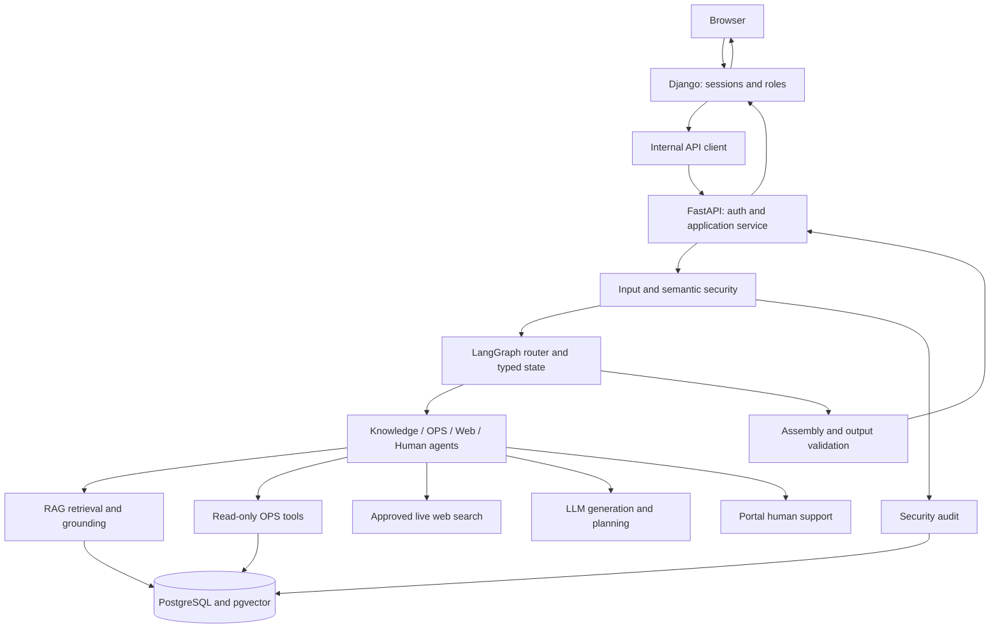

### Project structure and important files

| Path | Responsibility |
| --- | --- |
| [apps/agent_api/app/](apps/agent_api/app/) | AI application: `agents/`, `rag/`, `tools/`, `security/`, `llm/`, `web/`, `database/`, `evaluation/`; `chat.py`, `composition.py` and `telemetry.py` provide application wiring and cross-cutting contracts. |
| [apps/web_portal/](apps/web_portal/) | `accounts/` owns identity/roles; `conversations/` owns transcripts/turns; `support/` owns human workflows; `admin_portal/` owns administration and audit pages. `integrations/` contains internal clients; `templates/`, `static/` and `config/` provide presentation and Django configuration. |
| [database/](database/) | Ordered SQL migrations and synthetic OPS seed, distinct from Django app migrations. |
| [evaluation/](evaluation/) | Versioned evidence datasets, challenge scenarios and historical reports. |
| [tests/](tests/) | API/domain contracts, integration and end-to-end checks; Django app tests also live beside portal code. |
| [docs/](docs/) | Challenge, architecture specifications, decision log and roadmap. |
| [scripts/](scripts/) | Manual chat entry point and local service-token helper. |

| Important file | Responsibility |
| --- | --- |
| [apps/agent_api/app/main.py](apps/agent_api/app/main.py) | FastAPI routes and lifecycle |
| [apps/agent_api/app/composition.py](apps/agent_api/app/composition.py) | Runtime dependency composition |
| [apps/agent_api/app/chat.py](apps/agent_api/app/chat.py) | Application service and HTTP models |
| [apps/agent_api/app/auth.py](apps/agent_api/app/auth.py) | Trusted internal authentication |
| [apps/agent_api/app/agents/orchestration.py](apps/agent_api/app/agents/orchestration.py) | Graph nodes, routing and assembly |
| [apps/agent_api/app/agents/router.py](apps/agent_api/app/agents/router.py) | Security-aware capability routing |
| [apps/agent_api/app/agents/knowledge.py](apps/agent_api/app/agents/knowledge.py) | Persistent grounded knowledge |
| [apps/agent_api/app/agents/customer_support.py](apps/agent_api/app/agents/customer_support.py) | Operational planning and facts |
| [apps/agent_api/app/agents/human_escalation.py](apps/agent_api/app/agents/human_escalation.py) | Human transition state machine |
| [apps/agent_api/app/rag/retrieval/hybrid.py](apps/agent_api/app/rag/retrieval/hybrid.py) | Lexical/vector retrieval coordination |
| [apps/agent_api/app/rag/publication/service.py](apps/agent_api/app/rag/publication/service.py) | Atomic publication |
| [apps/agent_api/app/tools/ops.py](apps/agent_api/app/tools/ops.py) | Authorized operational tools |
| [apps/agent_api/app/database/connection.py](apps/agent_api/app/database/connection.py) | Async database pool |
| [apps/agent_api/app/security/audit.py](apps/agent_api/app/security/audit.py) | Sanitized durable security evidence |
| [apps/agent_api/app/security/semantic.py](apps/agent_api/app/security/semantic.py) | Semantic and output security |
| [apps/web_portal/conversations/agent_turns.py](apps/web_portal/conversations/agent_turns.py) | Portal request and stale-result handling |
| [apps/web_portal/conversations/services.py](apps/web_portal/conversations/services.py) | Atomic message persistence/idempotency |
| [apps/web_portal/integrations/agent_chat.py](apps/web_portal/integrations/agent_chat.py) | Trusted portal-to-API client |
| [apps/agent_api/app/evaluation/reporting.py](apps/agent_api/app/evaluation/reporting.py) | Versioned evaluation report serialization |
| [docker-compose.yml](docker-compose.yml) | Three-service deployment and volumes |

### Repository map and references

```text
getnet-support/
├── apps/
│   ├── agent_api/app/       # FastAPI, graph, agents, RAG, OPS, security, evaluation
│   └── web_portal/          # Django accounts, chat, support, admin
├── database/
│   ├── migrations/          # SQL prerequisites and rag/ops/audit/portal schemas
│   └── seed/ops/            # Synthetic operational cases
├── evaluation/              # Versioned datasets and checked-in reports
├── tests/                   # Unit, contract, integration, end-to-end
├── docs/                    # Challenge, design decisions, deployment and RAG guides
├── scripts/                 # Token helper and manual chat CLI
├── Dockerfile
├── docker-compose.yml
├── pyproject.toml
└── README.md
```

Start with [challenge](docs/challenge.md), [configuration](.env.example), [API](apps/agent_api/app/main.py), [graph](apps/agent_api/app/agents/orchestration.py), [chat contract](apps/agent_api/app/chat.py), [RAG guide](docs/rag-ingestion.md), [OPS seed guide](docs/ops-seed.md), and [deployment guide](docs/specs/phase-12/11-docker-and-deployment-spec.md). The GitHub repository is [julio7528/pocagente](https://github.com/julio7528/pocagente), with this project in `getnet-support/`.

---

## Português

**Sumário:** [Visão geral](#visão-geral) · [Desafio](#requisitos-do-desafio-e-implementação) · [Início rápido](#início-rápido) · [Configuração](#configuração-e-serviços) · [Build e execução](#build-e-execução) · [Stack](#stack-tecnológica) · [API](#api-e-fluxo-de-mensagens) · [Ciclo da mensagem](#ciclo-da-mensagem) · [LangGraph](#o-runtime-langgraph) · [Agentes](#contratos-dos-agentes) · [RAG](#rag-da-ingestão-à-resposta-fundamentada) · [Dados](#arquitetura-de-dados-e-postgresql) · [Segurança](#controles-de-segurança-e-auditoria) · [Atendimento humano](#handoff-humano-e-concorrência) · [Testes](#testes-avaliação-e-observabilidade) · [Decisões](#principais-decisões-arquiteturais) · [Roadmap](#estado-do-roadmap) · [Estrutura](#mapa-do-repositório-e-referências)

### Visão geral

Getnet Support é uma prova de conceito em Python para atendimento multiagente. O serviço FastAPI roteia solicitações por um fluxo LangGraph; o portal Django oferece chat autenticado, atendimento e administração. O PostgreSQL armazena fatos operacionais, material de RAG, eventos de auditoria e dados do portal. O sistema responde perguntas sobre produtos com evidências aprovadas, consulta registros operacionais para atendentes autorizados, utiliza informação atual da web quando cabível e encaminha conversas a humanos. A implementação responde ao [desafio](docs/challenge.md).

O projeto **não** executa cancelamentos nem outras transações comerciais. As ferramentas OPS consultam protocolos, solicitações, execuções e linhas do tempo; uma pergunta sobre protocolo de cancelamento pode exigir esclarecer qual produto ou serviço o usuário deseja **consultar**.

### Requisitos do Desafio e Implementação

| Requisito | Implementação e localização | Estado |
| --- | --- | --- |
| Três agentes distintos e comunicação explícita | Router, Knowledge e Customer Support trocam estado tipado no [grafo LangGraph](apps/agent_api/app/agents/orchestration.py); outras capacidades complementam o fluxo. | Implementado |
| Router como entrada e controlador | [Router](apps/agent_api/app/agents/router.py) escolhe rotas; arestas condicionais ordenam os agentes. | Implementado |
| Conhecimento de produtos, RAG e busca web | [Knowledge Agent](apps/agent_api/app/agents/knowledge.py), [recuperação híbrida](apps/agent_api/app/rag/retrieval/hybrid.py) e [Web Knowledge Agent](apps/agent_api/app/agents/web_knowledge.py). A ingestão pública usa registro de fontes aprovadas; a disponibilidade depende da publicação local. | Implementado; corpus precisa ser fornecido |
| Dados de atendimento e pelo menos duas ferramentas | [Customer Support Agent](apps/agent_api/app/agents/customer_support.py) usa [ferramentas OPS](apps/agent_api/app/tools/ops.py) somente de leitura, incluindo status de protocolo e investigação de falha de execução. Exige autorização. | Implementado |
| Endpoint HTTP JSON | `POST /chat` no [FastAPI](apps/agent_api/app/main.py) recebe `message` e `user_id`, além de contexto tipado opcional. | Implementado |
| Docker | [Dockerfile do agente](Dockerfile), [Dockerfile do portal](apps/web_portal/Dockerfile) e [Compose](docker-compose.yml). | Implementado |
| Testes e integração | [Testes unitários e de contrato](tests/), [integração](tests/integration/), [ponta a ponta](tests/e2e/) e testes dos apps Django. | Implementado |
| Linguagem e frameworks | Python 3.14+, FastAPI, Django, LangGraph, Pydantic, Psycopg, PostgreSQL/pgvector e FastEmbed; veja [dependências](pyproject.toml). | Implementado |
| Escalonamento humano | [Human Escalation Agent](apps/agent_api/app/agents/human_escalation.py) e fluxo do portal de atendimento. | Implementado |
| Guardrails | Segurança de entrada, semântica e saída; autorização, sanitização, auditoria e falhas controladas. | Implementado |
| Avaliação e observabilidade | [Datasets versionados](evaluation/), [runners](apps/agent_api/app/evaluation/), [telemetria](apps/agent_api/app/telemetry.py), debugger e painel de auditoria. | Implementado; relatório publicado é histórico |
| Vídeo de apresentação | Não há vídeo de walkthrough no repositório. | Item externo da entrega |

A tabela cobre os [requisitos centrais e bônus](docs/challenge.md). Os exemplos do desafio têm correspondência no [conjunto de cenários](evaluation/challenge/scenarios-v1.yaml); os resultados dependem das evidências, autorização e provedores configurados.

#### Requisitos bônus

| Bônus | Capacidade implementada |
| --- | --- |
| Quarto agente | Human Escalation determinístico com transições tipadas. |
| Guardrails | Política determinística/semântica de entrada, revisão de saída e auditoria sanitizada. |
| Encaminhamento/handoff | Confirmação, fila, responsabilidade do operador e suspensão da automação na mesma conversa. |
| Avaliação/observabilidade | Suítes versionadas RAG/desafio, relatórios, traces limitados e painel de segurança. |

Portal Django, RBAC, idempotência, fila de atendimento e administração ampliam o desafio original de agentes HTTP. Integração bancária/liquidação real fica fora desta POC; OPS demonstra consulta autorizada com registros operacionais sintéticos.

### Início rápido

Pré-requisitos: Git, Docker Engine/Desktop com Compose v2 que suporte `up --wait`, Python 3.14+ para comandos locais de desenvolvimento/geração de token, rede para baixar imagens/pacotes/pesos de embeddings e credenciais locais dos provedores. A primeira migração exige PostgreSQL 17 e pgvector 0.8.6. Para um novo checkout:

```powershell
git clone https://github.com/julio7528/pocagente.git
Set-Location pocagente/getnet-support
```

Execute na raiz do repositório em **PowerShell**, com Docker Desktop/Compose disponível. A inicialização SQL abaixo pressupõe um banco novo. Não faça commit do `.env` nem das credenciais geradas.

```powershell
Copy-Item .env.example .env
# Edite .env: defina POSTGRES_PASSWORD, DJANGO_SECRET_KEY e DEEPSEEK_API_KEY locais.
python scripts/create_docker_service_token.py
docker compose up -d --wait postgres
$compose = docker compose config --format json | ConvertFrom-Json
$dbUser = $compose.services.postgres.environment.POSTGRES_USER
$dbName = $compose.services.postgres.environment.POSTGRES_DB
Get-ChildItem .\database\migrations\*.sql | Sort-Object Name | ForEach-Object {
    Get-Content -Raw $_.FullName | docker compose exec -T postgres psql -v ON_ERROR_STOP=1 -U $dbUser -d $dbName
    if ($LASTEXITCODE -ne 0) { throw "Falha na migração SQL: $($_.Name)" }
}
docker compose build
docker compose run --rm --no-deps web-portal python apps/web_portal/manage.py migrate --noinput
docker compose up -d agent-api web-portal
docker compose run --rm --no-deps web-portal python apps/web_portal/manage.py bootstrap_admin
```

O último comando solicita interativamente usuário e senha do primeiro administrador. Abra <http://127.0.0.1:8001/>; login em `/login/`, chat em `/chat/`, atendimento em `/support/` e administração em `/admin-portal/`. A API fica em <http://127.0.0.1:8000/>; `/health` verifica vida e `/ready` verifica prontidão. O portal possui `/health/` e `/ready/`. O Compose publica as portas apenas no loopback. Consulte o [guia de implantação](docs/specs/phase-12/11-docker-and-deployment-spec.md).

A API pode ficar pronta com RAG vazio, mas respostas fundamentadas exigem publicação. `knowledge/` e `reference/` foram removidos do controle de versão e ignorados: um clone novo **não** contém Markdown interno curado nem registro público. Obtenha os arquivos aprovados pelo processo interno antes dos comandos de publicação. Uma chave DeepSeek configurada é necessária para respostas com LLM; Tavily é opcional para busca web atual.

Antes de habilitar Tavily, forneça `knowledge/internal/cancellation-process/public/sources.yaml`: o contexto web carrega esse registro ao compor o runtime. Provedor de busca configurado com registro ausente/inválido pode deixar a API indisponível. Sem chave Tavily, a capacidade opcional é omitida. O início rápido de clone novo pressupõe a chave Tavily vazia do modelo até instalar as fontes aprovadas.

### Configuração e serviços

| Variável | Finalidade | Obrigatória | Segredo? |
| --- | --- | --- | --- |
| `POSTGRES_HOST`, `POSTGRES_PORT` | Endereço do banco; Compose define host `postgres`. | Acesso ao banco | Não |
| `POSTGRES_DB`, `POSTGRES_USER` | Banco e identidade de conexão. | Sim | Configuração, não senha |
| `POSTGRES_PASSWORD` | Autenticação no banco. | Sim | Sim |
| `POSTGRES_SSLMODE` | Modo TLS do driver; modelo usa `disable` no desenvolvimento local. | Padrão fornecido | Não |
| `POSTGRES_CONNECT_TIMEOUT_SECONDS` | Prazo para conexão. | Padrão fornecido | Não |
| `POSTGRES_POOL_MIN_SIZE`, `POSTGRES_POOL_MAX_SIZE`, `POSTGRES_POOL_TIMEOUT_SECONDS` | Capacidade e espera do pool da API. | Padrões fornecidos | Não |
| `DEEPSEEK_API_KEY` | Autenticação do LLM. | Runtime com LLM | Sim |
| `DEEPSEEK_MODEL`, `DEEPSEEK_BASE_URL`, `DEEPSEEK_TIMEOUT_SECONDS` | Modelo, endereço e timeout do provedor. | Padrões fornecidos | Não |
| `TAVILY_API_KEY` | Autenticação de busca. | Busca web atual | Sim |
| `TAVILY_BASE_URL`, `TAVILY_TIMEOUT_SECONDS` | Endereço e timeout da busca. | Padrões fornecidos | Não |
| `DJANGO_SECRET_KEY` | Segurança de assinatura/sessão. | Inicialização do portal | Sim |
| `DJANGO_DEBUG`, `DJANGO_ALLOWED_HOSTS` | Diagnóstico e hosts aceitos; Compose força debug desligado. | Padrões fornecidos | Não |
| `WEB_PORTAL_SECURE_COOKIES` | Restringe cookies a HTTPS em implantação com TLS. | Padrão fornecido | Não |
| `PORTAL_DEBUGGER_ENABLED` | Habilita debugger conforme sua política de acesso. | Opcional | Não |
| `AGENT_API_INTERNAL_URL` | Endereço portal/API; Compose configura automaticamente. | Chamadas do portal | Não |
| `AGENT_API_SERVICE_TOKEN` | Credencial interna compartilhada, gerada pelo helper. | API e chamadas do portal | Sim |
| `AGENT_API_CONNECT_TIMEOUT_SECONDS`, `AGENT_API_READ_TIMEOUT_SECONDS` | Prazos de transporte do portal. | Padrões fornecidos | Não |

O modelo seguro é [.env.example](.env.example). Configure `POSTGRES_DB`, `POSTGRES_USER` e `POSTGRES_PASSWORD` para PostgreSQL; `DJANGO_SECRET_KEY` para o portal; `DEEPSEEK_API_KEY`, `DEEPSEEK_MODEL` e `DEEPSEEK_BASE_URL` para o LLM; opcionalmente `TAVILY_API_KEY` para busca atual. O [gerador de token](scripts/create_docker_service_token.py) cria `.docker-secrets/agent-api.env` sem exibir o segredo. O Compose o injeta nos dois serviços de aplicação. `AGENT_API_INTERNAL_URL` aponta para `http://agent-api:8000` dentro do Compose. Consulte os demais timeouts e opções do portal no modelo, sem copiar credenciais reais para a documentação.

| Serviço | Imagem/build | Porta | Função |
| --- | --- | --- | --- |
| `postgres` | `pgvector/pgvector:0.8.6-pg17-bookworm` | `127.0.0.1:5432` | Schemas `rag`, `ops`, `audit` e portal; volume persistente. |
| `agent-api` | [Dockerfile raiz](Dockerfile) | `127.0.0.1:8000` | FastAPI, LangGraph, provedores e busca; volume de cache FastEmbed. |
| `web-portal` | [Dockerfile do portal](apps/web_portal/Dockerfile) | `127.0.0.1:8001` | Sessões Django, páginas por perfil, administração e cliente da API interna. |

Os arquivos SQL [0001–0007](database/migrations/) criam extensão e schemas `rag`, `ops`, `audit` e portal; `migrate` do Django cria as tabelas do portal depois. Os Dockerfiles não executam essas migrações automaticamente. Em banco existente, aplique somente migrações pendentes pelo procedimento controlado do projeto; o loop acima é para inicialização de banco novo.

Para desenvolvimento Python local, utilize Python 3.14+ e instale o [pyproject.toml](pyproject.toml):

```powershell
python -m venv .venv
.\.venv\Scripts\Activate.ps1
python -m pip install -e '.[dev]'
```

Os processos locais ainda precisam de PostgreSQL, variáveis de ambiente, migrações e token de serviço. O Compose acima é o caminho completo mais curto. O [CLI manual](scripts/chat_cli.py) acessa uma API em execução ou roda no processo; `python -m scripts.chat_cli --help` mostra opções de perfis sintéticos. Ele é ferramenta de desenvolvimento, não substitui a autenticação do portal.

### Build e execução

#### Operação com Docker

Após inicializar, reconstrua as aplicações alteradas e consulte a prontidão:

```powershell
docker compose up -d --build agent-api web-portal
docker compose ps
Invoke-RestMethod http://127.0.0.1:8000/ready
Invoke-RestMethod http://127.0.0.1:8001/ready/
```

`docker compose down` encerra/remove containers preservando os volumes nomeados. Um rebuild normal não reaplica SQL, seed OPS, publicação RAG nem criação do primeiro admin. Os containers das aplicações usam usuários sem privilégios de root. O Compose fornece os nomes DNS internos `postgres` e `agent-api`; o navegador usa os endereços loopback publicados. O portal depende do PostgreSQL saudável, mas não exige que a API esteja saudável antes de iniciar.

#### Agent API e Django locais

Após instalação editável, exporte as variáveis de `.env.example` para cada processo com os valores locais, incluindo o mesmo token nos dois serviços. Criar `.env` não faz todos os pontos de entrada carregarem o arquivo. Para portal no host, configure `AGENT_API_INTERNAL_URL` como `http://127.0.0.1:8000`. Com banco inicializado, execute em terminais separados:

```powershell
python -m uvicorn apps.agent_api.app.main:app --host 127.0.0.1 --port 8000
python -m uvicorn apps.web_portal.config.asgi:application --host 127.0.0.1 --port 8001
```

Psycopg assíncrono em Windows nativo exige event loop selector compatível; use os serviços Linux do Docker para o runtime completo no Windows. O CLI de publicação seleciona explicitamente um loop compatível nesse sistema. Os comandos acima são pontos de entrada ASGI, não carregadores de ambiente. A administração local também pode usar `python -m apps.web_portal.manage migrate --noinput` e `python -m apps.web_portal.manage bootstrap_admin` em checkout instalado/configurado.

#### RAG e OPS no Docker

O Compose fornece as variáveis de processo nestes exemplos:

```powershell
docker compose exec agent-api python -m database.seed.ops.runner --validate
docker compose exec agent-api python -m database.seed.ops.runner
docker compose exec agent-api python -m apps.agent_api.app.rag.publication.cli publish-curated
docker compose exec agent-api python -m apps.agent_api.app.rag.publication.cli publish-r2-curated
docker compose exec agent-api python -m apps.agent_api.app.rag.publication.cli publish-public-registry --all
docker compose exec agent-api python -m apps.agent_api.app.rag.publication.cli smoke-test --query "cancelamento de venda" --limit 5
```

A publicação exige os arquivos aprovados dentro do container. O Dockerfile do agente copia o contexto de build e não monta o corpus do host: é necessário rebuild após incluir arquivos locais nesse contexto. Forneça arquivos ausentes antes da publicação. Utilize seed sintético e dados de integração em banco de POC/descartável.

#### Diagnóstico da inicialização

| Sintoma | Conferência |
| --- | --- |
| Compose acusa env file ou variável obrigatória ausente | Crie `.env` pelo modelo, preencha variáveis e rode o gerador de token. |
| SQL rejeita versão ou schema existente | Use PostgreSQL 17/pgvector 0.8.6; o loop de inicialização é para banco novo. |
| Portal acusa tabelas ausentes ou login falha após setup | Aplique SQL 0007 e migrações Django; crie o primeiro admin interativamente. |
| `/ready` da API retorna 503 | Confira autenticação interna, conexão/extensão do banco, dependências e provedores. |
| RAG informa evidência insuficiente | Confira fontes, publicação, escopo ativo e resultados da busca. |
| Busca atual indisponível | Configure Tavily e a política de fontes/domínios aprovados. |

### Stack tecnológica

| Camada | Tecnologia | Responsabilidade |
| --- | --- | --- |
| Runtime | Python 3.14+ | Linguagem comum da API, portal, ingestão e avaliação. |
| Aplicação de navegador | Django | Sessões, CSRF, perfis, tabelas do portal via ORM, templates e administração. |
| Fronteira de serviço | FastAPI, Uvicorn, Pydantic | ASGI e contratos rígidos de entrada/saída. |
| Orquestração | LangGraph | Grafo compilado, estado tipado e transições condicionais. |
| Transporte LLM | DeepSeek, HTTPX | Classificação, planejamento, grounding e recuperação por interfaces de provedor. |
| Busca atual | Tavily | Evidências públicas atuais e delimitadas. |
| Persistência | PostgreSQL 17, Psycopg 3, psycopg-pool | Acesso assíncrono por repositórios e transações. |
| Recuperação | pgvector 0.8.6, PostgreSQL FTS, FastEmbed | Candidatos vetoriais/lexicais e embeddings multilíngues locais. |
| Ferramentas de dados | PyYAML, pypdf | Registros/datasets estruturados e ferramentas de ingestão PDF suportadas. |
| Empacotamento e qualidade | Docker Compose, pytest, runner Django | Implantação local, contratos e integração. |

Versões Python estão no [pyproject.toml](pyproject.toml); a imagem do portal tem [dependências próprias](apps/web_portal/requirements-docker.txt). As versões do banco estão no [Compose](docker-compose.yml).

### API e fluxo de mensagens

`POST /chat` aceita JSON como `{"message":"Como funciona o Link de Pagamento Getnet?","user_id":"usuario-exemplo"}`. A resposta tipada inclui `status`, `route`, `reason` e, quando aplicável, `answer`, `citations`, dados de conhecimento/atendimento e encaminhamento humano; veja os [modelos](apps/agent_api/app/chat.py). O endpoint é uma **fronteira interna entre serviços**: exige token bearer compartilhado e cabeçalhos confiáveis de identidade/perfil, além de `user_id` no JSON. O [módulo de autenticação](apps/agent_api/app/auth.py) valida o token e `X-Authenticated-User-Id`, `X-Authenticated-Role` e `X-Ops-Authorized`; clientes não concedem a si mesmos acesso OPS. O Django faz essa chamada para usuários autenticados. Administradores não usam `/chat`.

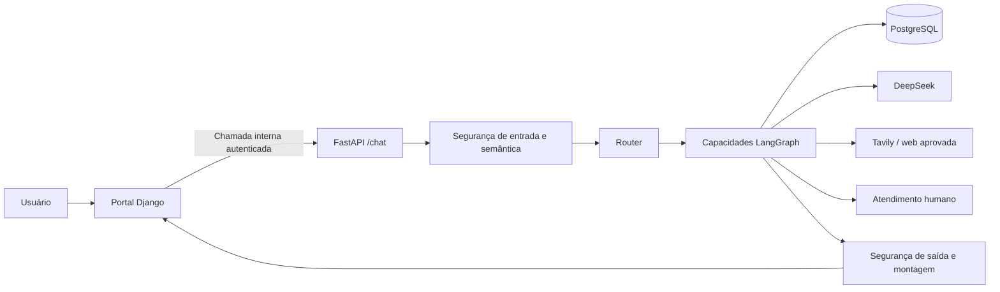

O [serviço de aplicação](apps/agent_api/app/chat.py) valida autorização, invoca o grafo, aplica recuperação/checagens de saída e devolve resposta com campos permitidos. O portal pode enviar uma janela limitada do histórico e contexto operacional ou humano nos campos opcionais tipados de `ChatRequest`; o payload simples do desafio continua válido. As [URLs do portal](apps/web_portal/config/urls.py) expõem os fluxos de navegador; as [rotas FastAPI](apps/agent_api/app/main.py) também incluem debug, painel de auditoria e transições humanas protegidos. `/internal/chat/debug` devolve trace limitado a um serviço autenticado. Rotas administrativas de auditoria exigem perfil admin; não são análises públicas.

#### Referência dos endpoints

| Método e caminho | Acesso e resposta |
| --- | --- |
| `GET /health` | Vida, `{"status":"ok"}`. |
| `GET /ready` | Prontidão com `status` e `detail`; 503 se indisponível. Não testa qualidade do provedor a cada chamada. |
| `POST /chat` | Serviço confiável e identidade não admin; `ChatResponse` tipado. |
| `POST /internal/chat/debug` | Mesma autorização do chat; resposta, trace limitado e indicador de truncamento. |
| `GET /internal/admin/audit/summary` | Contagens agregadas para admin. |
| `GET /internal/admin/audit/recent-activity` | Atividade recente, incluindo janela de segurança. |
| `GET /internal/admin/audit/timeseries` | Série diária para admin. |
| `GET /internal/admin/audit/breakdowns` | Estatísticas agrupadas para admin. |
| `GET /internal/admin/audit/events` | Lista paginada de eventos para admin. |
| `GET /internal/admin/audit/events/{event_id}` | Detalhe do evento para admin. |
| `POST /internal/human-escalation/transition` | Confirmação de cliente ou aceite/resolução por suporte autorizado. |

Exemplo seguro de requisição (os cabeçalhos devem corresponder à identidade confiável):

```json
{"message":"Olá!","user_id":"usuario-exemplo"}
```

Formato ilustrativo de resposta, sem representar execução gravada ou texto fixo do modelo:

```json
{
  "status": "COMPLETED",
  "route": "CONVERSATIONAL",
  "answer": "Olá! Como posso ajudar?",
  "citations": [],
  "requires_human": false,
  "reason": "BOUNDED_CONVERSATIONAL_RESPONSE"
}
```

Podem existir campos `intent`, `knowledge`, `customer_support` e `human`. Requisições legadas simples admitem até 4.000 caracteres; requisições contextualizadas do portal limitam a mensagem atual a 6.000 caracteres e o contexto a 13 itens, incluindo o turno atual. ID da conversa, ID do turno e contexto devem vir juntos. Erros HTTP usam `{"error":{"code":"...","message":"..."}}`: 401 é autenticação inválida, 403 operação proibida, 422 entrada inválida e 503 runtime indisponível. Resultado `PARTIAL` pode chegar com HTTP bem-sucedido pedindo esclarecimento.

### Ciclo da mensagem

1. As [views Django](apps/web_portal/conversations/views.py) verificam sessão, perfil, propriedade e formulário/identificadores do turno.
2. Os [serviços de conversa](apps/web_portal/conversations/services.py) persistem o turno do cliente com chave de idempotência, evitando duplicatas em retries.
3. [`_prepare_turn`](apps/web_portal/conversations/agent_turns.py) bloqueia brevemente a conversa, verifica estado ativo e existência de resposta anterior.
4. O [construtor de contexto](apps/web_portal/conversations/context.py) projeta janela limitada da mesma conversa; histórico é dado, nunca autorização.
5. [`AgentChatClient`](apps/web_portal/integrations/agent_chat.py) monta a chamada confiável. O HTTP ocorre fora da transação do banco do portal.
6. A [autenticação FastAPI](apps/agent_api/app/auth.py) valida token e identidade antes de [ChatApplicationService](apps/agent_api/app/chat.py) criar a solicitação de orquestração.
7. O grafo aciona Router para preflight determinístico, segurança semântica, intenção/necessidade de evidência e seleção de capacidades. Ferramentas e buscas autorizadas passam por contratos tipados.
8. Resultados são montados; a recuperação pode produzir esclarecimento ou fallback seguro. A segurança de saída revisa texto e payloads internos antes de serializar.
9. O Django formata citações seguras e chama `append_agent_message`, que bloqueia e revalida o estado antes de persistir a resposta automática.
10. Se ocorreu bloqueio, handoff ou encerramento durante a chamada, a resposta automática é suprimida. Caso contrário, a mensagem é gravada uma vez e exibida na conversa existente.

### O runtime LangGraph

Esta é a topologia de `_build_graph`; os predicados escolhem o caminho aplicável, portanto nem toda aresta é executada em um único turno.

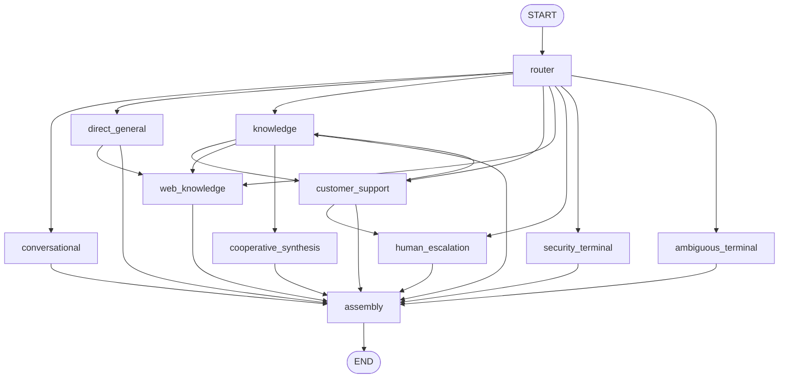

### LangGraph e agentes

O [grafo](apps/agent_api/app/agents/orchestration.py) começa em `router` e termina em `assembly`. Arestas condicionais selecionam `conversational`, `direct_general`, `knowledge`, `customer_support`, `cooperative_synthesis`, `web_knowledge`, `human_escalation`, `security_terminal` ou `ambiguous_terminal`. Knowledge pode seguir para suporte OPS ou fallback web; suporte pode seguir para síntese com conhecimento ou atendimento humano. O estado tipado carrega solicitação, decisão de rota, autorização, evidências e resultados. Há cooperação sequencial explícita.

| Capacidade | Responsabilidade e limite |
| --- | --- |
| [Router](apps/agent_api/app/agents/router.py) | Classifica intenção, necessidade de evidência e rota permitida antes do trabalho especializado. |
| [Conversational](apps/agent_api/app/agents/conversational.py) | Trata saudações, esclarecimento e respostas gerais limitadas. Necessidades atuais podem seguir à web. |
| [Knowledge](apps/agent_api/app/agents/knowledge.py) | Recupera trechos aprovados, monta contexto, gera respostas citadas e informa evidência insuficiente. |
| [Customer Support](apps/agent_api/app/agents/customer_support.py) | Planeja consultas OPS delimitadas e somente de leitura, pede identificadores ausentes e separa fatos de inferências. |
| [Web Knowledge](apps/agent_api/app/agents/web_knowledge.py) | Usa evidência externa atual via [adaptador Tavily](apps/agent_api/app/web/tavily.py) quando política e configuração permitem. |
| [Human Escalation](apps/agent_api/app/agents/human_escalation.py) | Cria/atualiza handoff estruturado e suspende automação quando operador assume. |

Exemplos: produto `router → knowledge → assembly` (com fallback web se a recuperação aprovada for insuficiente); protocolo autorizado `router → customer_support → assembly` após esclarecimento ou leitura; regra com caso concreto pode passar por `customer_support → knowledge → cooperative_synthesis`; fato externo atual pode seguir a `web_knowledge`; pedido humano segue a `human_escalation`. Entrada bloqueada termina em `security_terminal`. As rotas reais dependem de decisões e evidências tipadas.

### Contratos dos agentes

#### Router Agent

Entrada: mensagem, histórico limitado, permissão OPS confiável e contexto opcional de protocolo. Saída: `RouterDecision` imutável com rota, capacidades, escopo, política web e classificações de segurança. É chamado a cada solicitação de orquestração e não devolve registros operacionais nem escolhe ferramentas irrestritas. Veja [router.py](apps/agent_api/app/agents/router.py) e [roteamento semântico](apps/agent_api/app/agents/semantic_routing.py).

#### Conversational Agent

Entrada: pergunta atual e histórico limitado. Saída: resposta conversacional, esclarecimento ou resultado geral que indica necessidade de evidência atual. Trata saudações e conversas sem recuperação; o grafo pode transferir pedidos atuais para busca web. Não estabelece fatos sobre conta privada do cliente. Veja [conversational.py](apps/agent_api/app/agents/conversational.py).

#### Knowledge Agent

Entrada: `KnowledgeRequest` com pergunta, escopo de conhecimento persistente e contexto. Saída: `KnowledgeResult` com resposta/citações quando sustentadas, ou estado de insuficiência/erro do provedor. Consultas públicas Getnet podem ser reformuladas por [SearchQueryFormulation](apps/agent_api/app/agents/search_query_formulation.py) antes da busca híbrida. A pergunta original continua sendo a pergunta de grounding. O fallback web é decisão do grafo, sem publicação automática ou repetição irrestrita.

#### Customer Support Agent

Entrada: pergunta, seletores/contexto validados e `OpsAccessContext`. Saída: plano tipado, protocolo selecionado, fatos observados, inferências separadas, resposta ou esclarecimento/indisponibilidade. Atua em necessidades operacionais autorizadas. [OperationalTools](apps/agent_api/app/tools/ops.py) oferece `lookup_protocol_status`, `inspect_execution_failure`, `investigate_protocol`, `list_recent_protocols`, `list_recent_protocols_by_execution` e `query_analytics`. Listas recentes aceitam limites de 1–5. Identificadores ausentes ou ambiguidade podem exigir esclarecimento. A POC usa dados sintéticos de protocolos/execuções, sem integração real de liquidação de lojistas.

#### Web Knowledge Agent

Entrada: pergunta, escopo, consulta opcional reformulada e histórico. Saída: `KnowledgeResult` fundamentado em evidência pública atual. Tavily fornece resultados limitados; o construtor de contexto web fornece proveniência/citações. `PUBLIC_GETNET` restringe domínios aprovados. Previsão do tempo sem local pede essa informação. Evidências são transitórias: o agente não possui repositório RAG persistente e não grava resultados nas tabelas `rag`.

#### Human Escalation Agent

Entrada: `HumanEscalationRequest` tipado com estado/ação, referência da conversa, pacote seguro e autoridade confiável do operador. Saída: transição, rejeição ou suspensão. É uma capacidade determinística, sem dependência de LLM, banco ou fila. Django gerencia fila persistente, atribuição e histórico; a máquina de estados sozinha não cria chamado de suporte.

### Cooperação entre agentes

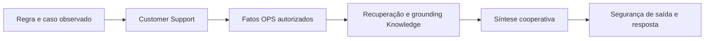

A rota combinada começa pelo suporte. Evidência operacional obtida pode então ser comparada à documentação de processo/produto na [orquestração](apps/agent_api/app/agents/orchestration.py). Fatos ausentes continuam ausentes; regra escrita não substitui execução observada. O grafo pode devolver resultado parcial ou escalar quando faltam pré-requisitos.

### RAG: da ingestão à resposta fundamentada

#### 1. Ingestão e aprovação

[Loaders](apps/agent_api/app/rag/ingestion/loader.py) recebem Markdown interno curado e registro de fontes públicas aprovadas. A [preparação](apps/agent_api/app/rag/ingestion/service.py) valida metadados e gera trechos; seu CLI não publica. A [publicação](apps/agent_api/app/rag/publication/service.py) cria embeddings e publica versões aprovadas de forma atômica, registrando execuções. A publicação pública respeita lista aprovada e busca limitada. Esses arquivos locais não vêm no clone novo.

#### 2. Armazenamento

A [migração SQL](database/migrations/0002_rag_tables.sql) define `rag.sources`, `rag.documents`, `rag.chunks` e `rag.ingestion_runs`. Os trechos têm dados de busca textual e vetor de 384 dimensões gerado por [FastEmbed](apps/agent_api/app/rag/embeddings/fastembed.py), modelo `sentence-transformers/paraphrase-multilingual-MiniLM-L12-v2`. PostgreSQL com pgvector é o banco vetorial; não há serviço vetorial separado.

#### 3. Recuperação

A [busca híbrida](apps/agent_api/app/rag/retrieval/hybrid.py) combina busca lexical PostgreSQL e semântica pgvector por [reciprocal rank fusion](apps/agent_api/app/rag/ranking/rrf.py). Por padrão há 10 candidatos lexicais, 10 semânticos e cinco finais, com constante RRF 60; veja [configuração](apps/agent_api/app/rag/config.py). Aplicam-se filtros de fonte ativa/aprovada e escopo.

#### 4. Grounding

O [context builder](apps/agent_api/app/rag/grounding/context_builder.py) ordena evidências elegíveis por proveniência, cria identificadores seguros de citação e rejeita evidência estruturalmente inutilizável. As instruções de conflito orientam a geração; o construtor não prova consistência semântica entre documentos. A proveniência interna fica separada da citação pública.

#### 5. Geração

O [Knowledge Agent](apps/agent_api/app/agents/knowledge.py) passa evidências delimitadas e IDs de citação à [geração fundamentada](apps/agent_api/app/agents/grounded_generation.py). Geração sem suporte ou com falha devolve resultado controlado, sem inventar fonte.


Com corpus local aprovado e banco inicializado, os comandos de publicação são:

```powershell
python -m apps.agent_api.app.rag.ingestion.cli public-registry .\knowledge\internal\cancellation-process\public\sources.yaml
python -m apps.agent_api.app.rag.publication.cli publish-curated
python -m apps.agent_api.app.rag.publication.cli publish-r2-curated
python -m apps.agent_api.app.rag.publication.cli publish-public-registry --registry .\knowledge\internal\cancellation-process\public\sources.yaml --all
python -m apps.agent_api.app.rag.publication.cli smoke-test --query "cancelamento de venda" --limit 5
```

Execute em ambiente Python configurado com acesso ao banco ou use o mesmo módulo em `agent-api`; cada comando exige seus arquivos aprovados e não integra o início rápido sem dados. O comando de preparação `public-registry` só valida; a publicação faz ingestão de rede. Detalhes no [guia RAG](docs/rag-ingestion.md).

#### Detalhes de ingestão e reingestão

O [normalizador](apps/agent_api/app/rag/ingestion/normalizer.py) estabiliza o conteúdo e o [checksum](apps/agent_api/app/rag/ingestion/checksum.py) identifica alterações. A preparação verifica identidade de fonte/documento: novo conteúdo é `INGEST`, alterado é `REINGEST`, inalterado é `SKIPPED_UNCHANGED`. O [chunker estrutural](apps/agent_api/app/rag/ingestion/chunker.py) agrupa seções Markdown e classifica limites de seção/regra de negócio/símbolo técnico. A proteção de 4.000 caracteres divide grupos excepcionais por parágrafos; não é garantia de limite de tokens. A publicação gera embeddings antes de tornar visível uma versão completa e registra seus resultados.

#### Banco vetorial e busca híbrida

`VECTOR(384)` restringe a dimensão no PostgreSQL. O repositório semântico usa distância de cosseno; o lexical usa busca textual PostgreSQL. Cada candidato conserva identidade física e proveniência. RRF soma `1 / (60 + rank)` por canal e deduplica pelo ID físico do trecho; não faz média de scores lexicais e de cosseno. O top-k é limitado antes da construção do contexto.

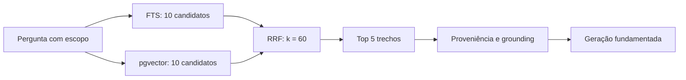

#### Regras de grounding e geração

O construtor distingue documentos internos de processo (PDD/SDD, prioridade 1), material técnico interno (prioridade 2) e material público oficial (prioridade 3). Metadados de fonte, documento, trecho, seção e localização preservam rastreabilidade. Citações internas usam rótulos genéricos e omitem caminhos privados; citações públicas podem incluir URLs seguras. A geração deve referenciar IDs fornecidos e pode indicar insuficiência. Validação de citações e suficiência reduzem respostas sem suporte, mas não provam a veracidade de cada afirmação; a avaliação mede separadamente recuperação, proveniência e suporte a afirmações.

### OPS, LLM e limites dos dados

As [tabelas OPS](database/migrations/0003_ops_tables.sql) representam emails recebidos, anexos, solicitações, estabelecimentos, execuções de automação e logs. Os [repositórios Psycopg](apps/agent_api/app/database/repositories/) expõem leituras fixas às [OperationalTools](apps/agent_api/app/tools/ops.py): status de protocolo, falhas, listas recentes, investigação de caso e análises limitadas. A autorização antecede as leituras. Dados OPS sintéticos podem ser validados e inseridos pelo [seed runner](database/seed/ops/runner.py), descrito no [guia](docs/ops-seed.md):

```powershell
python -m database.seed.ops.runner --validate
python -m database.seed.ops.runner
```

O segundo comando grava exemplos; use somente em banco destinado à POC. Ele não cria ações reais de cancelamento.

### Uso do LLM

O [DeepSeek](apps/agent_api/app/llm/deepseek.py) auxilia classificação semântica, planejamento operacional e geração. O [Tavily](apps/agent_api/app/web/tavily.py) traz evidência web atual opcional. Modelos não executam SQL arbitrário: o planejamento passa por contratos tipados, autorização, métodos fixos de repositório, grounding e segurança de saída. Observações OPS e regras de produto são classes distintas de evidência; a síntese cooperativa as reúne sem apresentar regra geral como estado observado do cliente. O [composition root](apps/agent_api/app/composition.py) conecta as dependências.

### Arquitetura de dados e PostgreSQL

| Schema | Responsabilidade | Consumidores principais |
| --- | --- | --- |
| `rag` | Fontes, documentos, trechos/vetores, execuções de ingestão. | Publicação e `RAGRepository`. |
| `ops` | `incoming_emails`, `email_attachments`, `service_requests`, `establishments`, `automation_runs`, `execution_log`. | Ferramentas de leitura e seed sintético. |
| `audit` | `security_events` sanitizados. | Sink de segurança e painel admin. |
| `portal` | Usuários/sessões Django, conversas/mensagens e dados de suporte. | ORM e fluxos do portal. |

O [pool assíncrono](apps/agent_api/app/database/connection.py) registra pgvector por conexão e gerencia aquisição/transação. [RAGRepository](apps/agent_api/app/database/repositories/rag.py), [OperationalRepository](apps/agent_api/app/database/repositories/operational.py) e [AuditRepository](apps/agent_api/app/database/repositories/audit.py) são as fronteiras SQL. Agentes chamam ferramentas/serviços/retrievers, que chamam repositórios. Django utiliza ORM e search path do portal; a API utiliza Psycopg nativo. Migrações SQL e Django têm responsabilidades distintas. O volume PostgreSQL mantém os quatro domínios em substituições normais de containers.

### Controles de segurança e auditoria

| Camada | Comportamento e código |
| --- | --- |
| Entrada | [Router](apps/agent_api/app/agents/router.py) aplica preflight determinístico antes do roteamento comum. |
| Semântica | [SemanticSecurityClassifier](apps/agent_api/app/security/semantic.py) devolve decisão validada de permitir/bloquear; histórico é contexto não confiável. |
| Terminal de bloqueio | [Orquestração](apps/agent_api/app/agents/orchestration.py) interrompe rotas protegidas; falta de taxonomia ou auditoria obrigatória não libera execução. |
| Sanitização | [Sanitizador](apps/agent_api/app/security/sanitization.py) remove conteúdo protegido antes da persistência de segurança. |
| Saída | `OutputSecurityGate` em [semantic.py](apps/agent_api/app/security/semantic.py), aplicado por [chat.py](apps/agent_api/app/chat.py), controla divulgação na resposta. |
| Auditoria | `SecurityAuditService → PostgresSecurityAuditSink → AuditRepository → audit.security_events`. |
| Falhas | Decisões inválidas e falha de auditoria obrigatória interrompem de forma controlada; falhas de telemetria são passivas e não substituem o resultado. |

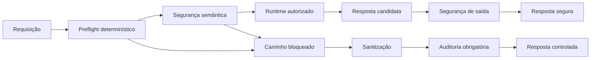

Auditoria é evidência persistente de segurança/governança, distinta de traces comuns. Uma requisição pode gerar vários eventos tipados, gravados atomicamente, com instante, tipo, componente, correlação de usuário/requisição, categoria, conteúdo sanitizado, ação e resultado. Credenciais brutas não devem ser gravadas nos campos de auditoria. Essa afirmação vale para a fronteira de auditoria: o portal persiste o texto das conversas, portanto não significa que um segredo digitado no chat jamais possa existir em qualquer parte do banco. Segredos de setup ficam em ambiente/arquivos locais, nunca no README ou Git; [.gitignore](.gitignore) e [.env.example](.env.example) definem o fluxo previsto.

### Handoff humano e concorrência


Esta é a máquina do agente de domínio. Confirmação exige ação explícita do usuário e pacote sanitizado correspondente; aceite exige operador de suporte. Resolução/retorno exige o responsável atual. O contrato HTTP interno expõe `CONFIRM`, `ACCEPT` e `RESOLVE`; `RETURN_TO_AUTOMATION` existe no domínio, mas não é um endpoint HTTP exposto. Estados persistentes da conversa no portal pertencem a outro modelo.

O portal restringe automação também durante a fila: [agent_turns.py](apps/web_portal/conversations/agent_turns.py) suprime respostas tardias quando a conversa passa a `WAITING_HUMAN`, `HUMAN`, `BLOCKED`, `CLOSED` ou `DELETED`. Os [serviços de conversa](apps/web_portal/conversations/services.py) bloqueiam/revalidam antes de inserir, e os [serviços de suporte](apps/web_portal/support/services.py) gerenciam fila/aceite. A chamada externa não mantém transação longa. Os [testes de concorrência](apps/web_portal/conversations/tests_agent_concurrency.py) cobrem essa disputa, evitando respostas conflitantes após transferência de responsabilidade.

### Segurança, auditoria e atendimento humano

Os [módulos de segurança](apps/agent_api/app/security/) cobrem verificações prévias e semânticas de entrada, sanitização, validação de saída e rejeição controlada. O terminal de segurança registra bloqueios pelo [serviço de auditoria](apps/agent_api/app/security/audit.py) em [`audit.security_events`](database/migrations/0004_audit_table.sql); se uma auditoria obrigatória estiver indisponível, o grafo não prossegue silenciosamente. Segredos e payloads sensíveis brutos ficam fora da resposta permitida e da telemetria limitada. O [serviço do painel](apps/agent_api/app/security/dashboard_service.py) e o [portal admin](apps/web_portal/admin_portal/) mostram resumos e eventos, inclusive atividade recente de segurança. Essa proteção abrange entrada, ferramentas, saída e persistência.

O [escalonamento humano](apps/agent_api/app/agents/human_escalation.py) tem estados e ações tipadas (oferecer, confirmar, aceitar, resolver). O pacote contém referência da conversa, fatos seguros, inferências, linha do tempo e referências opcionais de protocolo/execução. A [rota interna](apps/agent_api/app/main.py) recebe ações de operadores autorizados; o [portal de atendimento](apps/web_portal/support/) gerencia o fluxo visual. A espera por humano não significa aceite do operador; a posse ativa suspende o bot. Autenticação e perfis continuam valendo no handoff.

### Testes, avaliação e observabilidade

A suíte Python padrão está configurada no [pyproject.toml](pyproject.toml):

```powershell
python -m pytest
python -m pytest tests/integration tests/e2e
python apps/web_portal/manage.py test apps.web_portal.accounts apps.web_portal.conversations apps.web_portal.support apps.web_portal.admin_portal
```

Testes de integração podem exigir PostgreSQL, corpus aprovado e credenciais de provedor; confira condições de setup/skip de cada arquivo. Testes unitários e de contrato cobrem roteamento, autorização, RAG, OPS, segurança, API, avaliação e portal. Para uma integração completa, inicialize banco descartável, publique fixtures aprovadas, insira casos OPS sintéticos, percorra portal → API → grafo → armazenamento/provedor e confira citações, falhas de autenticação, transições humanas e ocultação no trace. Nenhum teste foi executado somente para escrever este README.

Os [datasets RAG](evaluation/rag/) e [cenários do desafio](evaluation/challenge/scenarios-v1.yaml) têm versões. [Runner RAG](apps/agent_api/app/evaluation/rag_runner.py), [runner do desafio](apps/agent_api/app/evaluation/challenge_runner.py), [métricas](apps/agent_api/app/evaluation/metrics.py) e [relatórios](apps/agent_api/app/evaluation/reporting.py) são módulos Python usados pelos testes; não há CLI independente de avaliação. O [relatório v1.1](evaluation/reports/phase11-evaluation-v1.1.json) registra execução local histórica de 27 casos RAG (24 passaram, 2 falharam, 1 não mensurável) e 14 cenários do desafio aprovados. Isso não descreve um clone novo nem esta atualização do README. Testes reproduzíveis relevantes: `python -m pytest tests/test_rag_evaluation_runner.py tests/test_challenge_evaluation_runner.py tests/test_evaluation_metrics_reporting.py` e, com pré-requisitos, `python -m pytest tests/integration/test_rag_evaluation_runner_real.py tests/e2e/test_phase11_challenge_evaluation_e2e.py`.

A [telemetria](apps/agent_api/app/telemetry.py) emite eventos tipados e limitados de rotas, capacidades, provedores, repositórios e segurança, com durações. A rota interna de debug e o debugger do portal exibem trace controlado; páginas de auditoria resumem eventos persistidos. Endpoints de saúde/prontidão e relatórios versionados fornecem sinais operacionais e de qualidade. Alertas de produção, retenção e backend externo de traces dependem de configuração de implantação.

#### Grupos de testes e pré-requisitos

| Suíte | O que verifica | Comando |
| --- | --- | --- |
| Grafo/API | Rotas, resultados tipados, autenticação e falhas do provedor. | `python -m pytest tests/test_langgraph_orchestration.py tests/test_chat_api.py` |
| OPS | Seletores, autorização e comportamento das ferramentas fixas. | `python -m pytest tests/test_ops_tools.py tests/test_ops_analytics.py` |
| RAG | Embeddings, publicação, repositório e contratos de busca. | `python -m pytest tests/test_rag_embeddings.py tests/test_rag_publication.py tests/test_rag_retrieval_contracts.py` |
| Avaliação | Contratos, observações dos runners, denominadores e relatórios. | Comandos da seção anterior. |
| Portal | Sessões/perfis, idempotência, concorrência, suporte/admin. | Comando Django acima. |

Testes reais de banco são opt-in: em ambiente descartável preparado, defina `$env:GETNET_RUN_DB_INTEGRATION = '1'`. A orquestração com DeepSeek real também verifica `$env:GETNET_RUN_DEEPSEEK_INTEGRATION = '1'`. São controles dos testes, não configurações de runtime ausentes do `.env.example`. RAG real exige manifesto aprovado e corpus local publicado. Algumas fixtures gravam dados; não use banco de produção. O runner Django precisa de permissão/configuração para criar seu banco/schema de testes.

#### Observabilidade e considerações de produção

Eventos incluem `SECURITY`, `SECURITY_SEMANTIC`, `SECURITY_OUTPUT`, `CLASSIFIER`, `INTENT`, `ROUTER`, `CAPABILITY_NEED`, `KNOWLEDGE_SCOPE`, `KNOWLEDGE_QUERY`, `WEB_POLICY`, `CAPABILITY`, `OPS_AUTHORIZATION`, `OPS_PLAN`, `OPS_TOOL`, `REPOSITORY`, `RAG`, `GROUNDING`, `WEB_SEARCH`, `LLM`, `PROVIDER_HTTP`, `PROVIDER_PARSE`, `PROVIDER_REQUEST`, `HUMAN`, `SECURITY_AUDIT` e `ORCHESTRATION`. O coletor limita cada requisição a 256 eventos e informa truncamento. Aceita códigos seguros, contagens e durações; não oferece campo de prompt bruto, SQL, payload do provedor ou texto de exceção. Esses traces operacionais não são o raciocínio interno do modelo.

Em produção, defina TLS/cookies, injeção de segredos, backups, retenção, limiares de alerta e destino externo de telemetria. Sinais úteis: falhas de prontidão, latência/erros de provedor, taxas de esclarecimento/resposta parcial, evidência insuficiente, falhas de auditoria e tempo em fila humana. O projeto contém sinais e painel; não provisiona uma plataforma completa de alertas de produção.

### Principais decisões arquiteturais

| Decisão | Motivo | Consequência |
| --- | --- | --- |
| Django separado de FastAPI/LangGraph | Autenticação/persistência do portal têm ciclo e confiança distintos da IA. | Contrato explícito de token/identidade e dois serviços. |
| Repositórios Psycopg assíncronos nativos | SQL fixo e limites transacionais são revisáveis. | API independente do ORM Django; pool explícito. |
| PostgreSQL com pgvector e FTS | Uma plataforma relacional para vetores, proveniência e dados operacionais/auditoria. | Menos serviços; versões de banco/extensão controladas. |
| FastEmbed local com RRF | Embeddings multilíngues sem API externa; combinar ranks em vez de scores brutos. | Pesos/cache locais e dimensão fixa de 384. |
| Grafo e contratos tipados | Restringir sugestões do modelo a rotas/planos permitidos e resultados mensuráveis. | Saídas inválidas/ausentes geram falha/estado parcial explícito. |
| Auditoria sanitizada com interrupção controlada | Preservar evidência sem gravar material protegido bruto. | Falha de auditoria obrigatória impede continuação protegida. |
| Handoff na mesma conversa | Preservar contexto ao transferir responsabilidade. | Transações, idempotência e revalidação de estado necessárias. |

As escolhas constam no [registro de decisões](docs/decision-log.md) e no código; este README não cria novo ADR.

### Estado do roadmap

| Grupo de marcos | Estado registrado |
| --- | --- |
| Fundação, contratos e projeto/acesso ao banco | Fundamentos implementados no roadmap e código. |
| Ingestão/publicação, busca híbrida/RRF e grounding (5–8) | Marcados como concluídos. |
| Runtime multiagente, ferramentas, web e handoff (9) | Concluído; fases posteriores do portal acrescentam persistência/UI. |
| Segurança/auditoria (10) | Concluído. |
| Avaliação (11) | Encerrada/revalidada; relatório histórico versionado. |
| Portal e Docker até 12.15 | Implementação e validação registradas como concluídas. |
| Validação final e documentação/encerramento da fase 12 (12.16–12.17) | Não iniciados/revisão do responsável pendente no roadmap. |
| Testes finais/entrega da POC (13) | Pendente no roadmap. |

Fonte: [roadmap](docs/project-roadmap.md). Funcionalidades implementadas não significam encerramento formal da fase. Vídeo de entrega ausente e corpus local excluído continuam relevantes para reprodução pelo avaliador.

### Decisões arquiteturais e evolução

As principais escolhas são: Django para navegador/autenticação e FastAPI para agentes; máquina de estados LangGraph tipada para roteamento explícito; repositórios Psycopg com SQL fixo; PostgreSQL/pgvector como plataforma transacional única; vetores multilíngues FastEmbed junto à busca lexical; fusão de rankings antes do grounding; e autenticação rígida entre serviços. O [registro de decisões](docs/decision-log.md) explica as razões e o [roadmap](docs/project-roadmap.md) registra a evolução por fases. Esses documentos têm planos históricos; este README descreve o código atual. Próximos passos possíveis: empacotar corpus aprovado para ambientes reproduzíveis, oferecer CLI de avaliação e configurar monitoramento de produção.

### Arquitetura de ponta a ponta

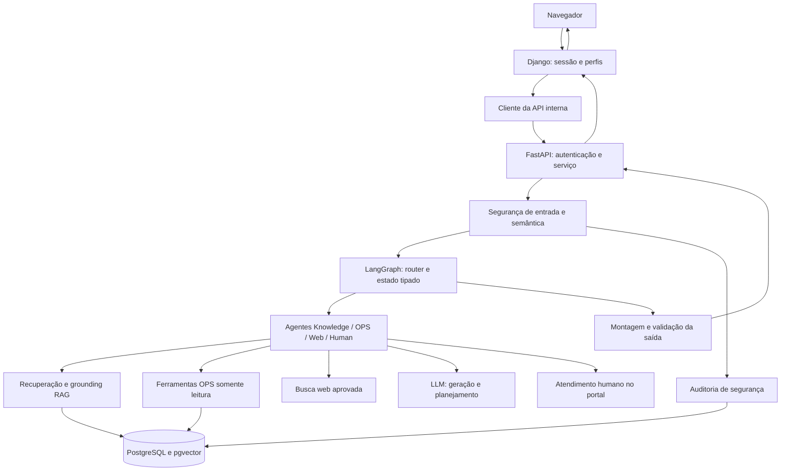

### Estrutura do projeto e arquivos importantes

| Caminho | Responsabilidade |
| --- | --- |
| [apps/agent_api/app/](apps/agent_api/app/) | Aplicação IA: `agents/`, `rag/`, `tools/`, `security/`, `llm/`, `web/`, `database/`, `evaluation/`; `chat.py`, `composition.py` e `telemetry.py` conectam aplicação e contratos transversais. |
| [apps/web_portal/](apps/web_portal/) | `accounts/` gerencia identidades/perfis; `conversations/`, históricos/turnos; `support/`, fluxos humanos; `admin_portal/`, administração/auditoria. `integrations/` contém clientes internos; `templates/`, `static/` e `config/` fornecem apresentação/configuração Django. |
| [database/](database/) | Migrações SQL ordenadas e seed OPS, distintos das migrações Django. |
| [evaluation/](evaluation/) | Datasets, cenários e relatórios históricos versionados. |
| [tests/](tests/) | Contratos de API/domínio, integração e ponta a ponta; testes Django também ficam nos apps do portal. |
| [docs/](docs/) | Desafio, especificações, decisões e roadmap. |
| [scripts/](scripts/) | Entrada manual de chat e gerador local de token. |

| Arquivo importante | Responsabilidade |
| --- | --- |
| [apps/agent_api/app/main.py](apps/agent_api/app/main.py) | Rotas FastAPI e ciclo de vida |
| [apps/agent_api/app/composition.py](apps/agent_api/app/composition.py) | Composição das dependências |
| [apps/agent_api/app/chat.py](apps/agent_api/app/chat.py) | Serviço de aplicação e modelos HTTP |
| [apps/agent_api/app/auth.py](apps/agent_api/app/auth.py) | Autenticação interna confiável |
| [apps/agent_api/app/agents/orchestration.py](apps/agent_api/app/agents/orchestration.py) | Nós, roteamento e montagem do grafo |
| [apps/agent_api/app/agents/router.py](apps/agent_api/app/agents/router.py) | Roteamento de capacidades com segurança |
| [apps/agent_api/app/agents/knowledge.py](apps/agent_api/app/agents/knowledge.py) | Conhecimento persistente fundamentado |
| [apps/agent_api/app/agents/customer_support.py](apps/agent_api/app/agents/customer_support.py) | Planejamento operacional e fatos |
| [apps/agent_api/app/agents/human_escalation.py](apps/agent_api/app/agents/human_escalation.py) | Máquina de transições humanas |
| [apps/agent_api/app/rag/retrieval/hybrid.py](apps/agent_api/app/rag/retrieval/hybrid.py) | Coordenação lexical/vetorial |
| [apps/agent_api/app/rag/publication/service.py](apps/agent_api/app/rag/publication/service.py) | Publicação atômica |
| [apps/agent_api/app/tools/ops.py](apps/agent_api/app/tools/ops.py) | Ferramentas operacionais autorizadas |
| [apps/agent_api/app/database/connection.py](apps/agent_api/app/database/connection.py) | Pool assíncrono do banco |
| [apps/agent_api/app/security/audit.py](apps/agent_api/app/security/audit.py) | Evidência persistente sanitizada |
| [apps/agent_api/app/security/semantic.py](apps/agent_api/app/security/semantic.py) | Segurança semântica e de saída |
| [apps/web_portal/conversations/agent_turns.py](apps/web_portal/conversations/agent_turns.py) | Turnos do portal e resultados tardios |
| [apps/web_portal/conversations/services.py](apps/web_portal/conversations/services.py) | Persistência atômica e idempotência |
| [apps/web_portal/integrations/agent_chat.py](apps/web_portal/integrations/agent_chat.py) | Cliente confiável portal/API |
| [apps/agent_api/app/evaluation/reporting.py](apps/agent_api/app/evaluation/reporting.py) | Serialização dos relatórios |
| [docker-compose.yml](docker-compose.yml) | Três serviços e volumes |

### Mapa do repositório e referências

```text
getnet-support/
├── apps/
│   ├── agent_api/app/       # FastAPI, grafo, agentes, RAG, OPS, segurança, avaliação
│   └── web_portal/          # Django: contas, chat, suporte, admin
├── database/
│   ├── migrations/          # SQL para schemas rag/ops/audit/portal
│   └── seed/ops/            # Casos operacionais sintéticos
├── evaluation/              # Datasets versionados e relatórios incluídos
├── tests/                   # Unitários, contratos, integração, ponta a ponta
├── docs/                    # Desafio, decisões, implantação e guias RAG
├── scripts/                 # Gerador de token e CLI manual de chat
├── Dockerfile
├── docker-compose.yml
├── pyproject.toml
└── README.md
```

Comece pelo [desafio](docs/challenge.md), [configuração](.env.example), [API](apps/agent_api/app/main.py), [grafo](apps/agent_api/app/agents/orchestration.py), [contrato de chat](apps/agent_api/app/chat.py), [guia RAG](docs/rag-ingestion.md), [guia de seed OPS](docs/ops-seed.md) e [guia de implantação](docs/specs/phase-12/11-docker-and-deployment-spec.md). O repositório GitHub é [julio7528/pocagente](https://github.com/julio7528/pocagente), com este projeto em `getnet-support/`.
