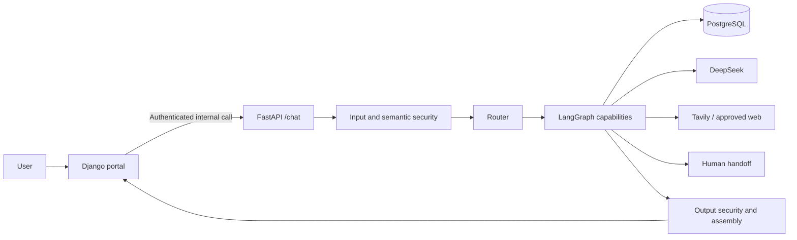
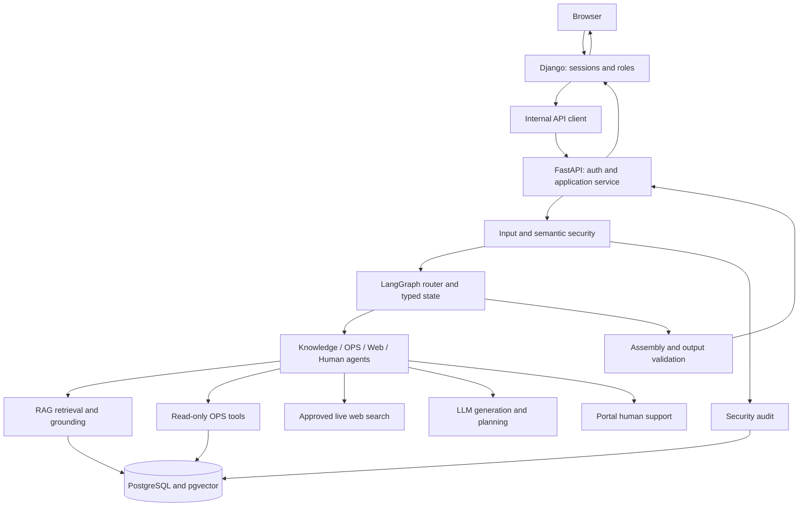
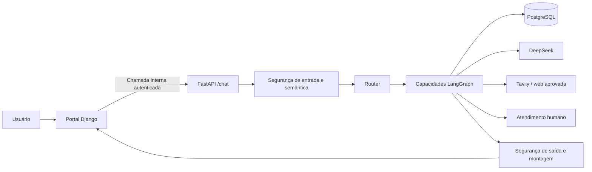
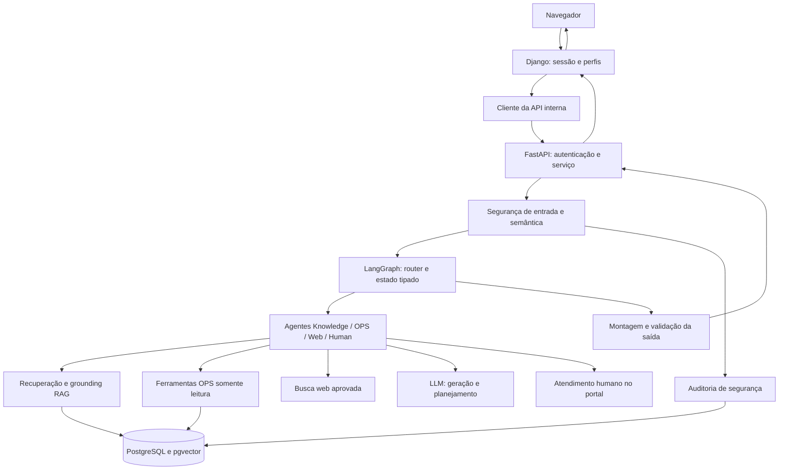

# Getnet Support

This README is available in English and Portuguese.  
Este README está disponível em inglês e português.

[English](#english) · [Português](#português)

## English

### Overview

Getnet Support is a Python proof of concept for multi-agent customer assistance. A FastAPI service routes requests through a LangGraph workflow; a Django portal supplies authenticated chat, support, and administration screens. PostgreSQL stores operational facts, RAG material, audit events, and portal data. The system answers product questions from approved evidence, investigates existing operational records for authorized support staff, uses live web evidence where appropriate, and can hand a conversation to a human. The implementation is organized around the [challenge brief](docs/challenge.md).

The project does **not** execute cancellations or other business transactions. Its OPS tools read protocol, request, execution, and timeline data; a question about a cancellation protocol may require identifying which product or service the user wants to **consult**.

### Capabilities and challenge coverage

| Challenge item | Implementation and location | Status |
| --- | --- | --- |
| Three distinct agents and explicit communication | Router, Knowledge, and Customer Support exchange typed state in the [LangGraph graph](apps/agent_api/app/agents/orchestration.py); other capabilities extend it. | Implemented |
| Router as entry point and sequence controller | [Router](apps/agent_api/app/agents/router.py) selects routes; conditional graph edges sequence agents. | Implemented |
| Product knowledge, RAG, and web search | [Knowledge Agent](apps/agent_api/app/agents/knowledge.py), [hybrid retrieval](apps/agent_api/app/rag/retrieval/hybrid.py), and [Web Knowledge Agent](apps/agent_api/app/agents/web_knowledge.py). Public ingestion uses an approved source registry; content availability depends on local publication. | Implemented; corpus must be supplied |
| Customer data and at least two tools | [Customer Support Agent](apps/agent_api/app/agents/customer_support.py) uses read-only [OPS tools](apps/agent_api/app/tools/ops.py), including protocol status and execution-failure investigation. Access requires an authorized principal. | Implemented |
| JSON HTTP endpoint | `POST /chat` in [FastAPI](apps/agent_api/app/main.py) accepts `message` and `user_id` plus optional typed context. | Implemented |
| Docker build and deployment | [Agent Dockerfile](Dockerfile), [portal Dockerfile](apps/web_portal/Dockerfile), and [Compose](docker-compose.yml). | Implemented |
| Tests and integration strategy | [Unit/contract tests](tests/), [integration tests](tests/integration/), [end-to-end tests](tests/e2e/), and Django app tests. | Implemented |
| Language and frameworks | Python 3.14+, FastAPI, Django, LangGraph, Pydantic, Psycopg, PostgreSQL/pgvector, FastEmbed; see [dependencies](pyproject.toml). | Implemented |
| Human escalation and redirect | [Human Escalation Agent](apps/agent_api/app/agents/human_escalation.py) and portal support workflow. | Implemented |
| Guardrails | Input/semantic/output security, authorization, sanitization, audit, controlled failure paths. | Implemented |
| Evaluation and observability | [Versioned datasets](evaluation/), [runners](apps/agent_api/app/evaluation/), [telemetry](apps/agent_api/app/telemetry.py), portal debugger and audit dashboard. | Implemented; published report is a historical artifact |
| Submission video | No walkthrough video is included in the repository. | External submission item |

These rows map the [core and bonus requirements](docs/challenge.md). The challenge's example prompts are represented by the [scenario suite](evaluation/challenge/scenarios-v1.yaml); outcomes depend on available evidence, authorization, and provider configuration.

### Quick start

Run the following from the repository root in **PowerShell**, with Docker Desktop/Compose available. Use a fresh database for the SQL initialization shown here. Do not commit `.env` or generated service credentials.

```powershell
Copy-Item .env.example .env
# Edit .env: set local POSTGRES_PASSWORD, DJANGO_SECRET_KEY, and DEEPSEEK_API_KEY.
python scripts/create_docker_service_token.py
docker compose up -d postgres
$compose = docker compose config --format json | ConvertFrom-Json
$dbUser = $compose.services.postgres.environment.POSTGRES_USER
$dbName = $compose.services.postgres.environment.POSTGRES_DB
Get-ChildItem .\database\migrations\*.sql | Sort-Object Name | ForEach-Object {
    Get-Content -Raw $_.FullName | docker compose exec -T postgres psql -v ON_ERROR_STOP=1 -U $dbUser -d $dbName
    if ($LASTEXITCODE -ne 0) { throw "SQL migration failed: $($_.Name)" }
}
docker compose build
docker compose run --rm --no-deps web-portal python apps/web_portal/manage.py migrate --noinput
docker compose up -d agent-api web-portal
docker compose run --rm --no-deps web-portal python apps/web_portal/manage.py bootstrap_admin
```

The last command asks interactively for the first admin username and password. Open the portal at <http://127.0.0.1:8001/>; its login is at `/login/`, chat at `/chat/`, support at `/support/`, and admin portal at `/admin-portal/`. The Agent API is bound to <http://127.0.0.1:8000/>; `/health` checks liveness and `/ready` checks runtime readiness. The portal also has `/health/` and `/ready/`. Compose publishes all three services only on loopback. See [deployment notes](docs/specs/phase-12/11-docker-and-deployment-spec.md).

The API can be ready with an empty RAG corpus, but evidence-backed answers require publication. `knowledge/` and `reference/` were removed from Git tracking and are ignored: a fresh clone does **not** include the curated internal Markdown or public registry. Obtain approved files through the project's internal process before using the publication commands below. A configured DeepSeek key is needed for LLM-backed answers; Tavily is optional for live web search.

### Configuration and services

The safe template is [.env.example](.env.example). Set `POSTGRES_DB`, `POSTGRES_USER`, and `POSTGRES_PASSWORD` for PostgreSQL; `DJANGO_SECRET_KEY` for the portal; `DEEPSEEK_API_KEY`, `DEEPSEEK_MODEL`, and `DEEPSEEK_BASE_URL` for the LLM; and optionally `TAVILY_API_KEY` for live search. The [token helper](scripts/create_docker_service_token.py) creates `.docker-secrets/agent-api.env` without printing the token. Compose injects it into both application services. `AGENT_API_INTERNAL_URL` is set to `http://agent-api:8000` inside Compose. Review other timeouts and portal flags in the template rather than copying real credentials into documentation.

| Service | Image/build | Port | Purpose |
| --- | --- | --- | --- |
| `postgres` | `pgvector/pgvector:0.8.6-pg17-bookworm` | `127.0.0.1:5432` | Persistent `rag`, `ops`, `audit`, and portal schemas; named data volume. |
| `agent-api` | [root Dockerfile](Dockerfile) | `127.0.0.1:8000` | FastAPI, LangGraph, providers, retrieval; named FastEmbed cache volume. |
| `web-portal` | [portal Dockerfile](apps/web_portal/Dockerfile) | `127.0.0.1:8001` | Django sessions, role-specific pages, admin, and internal API client. |

The SQL files [0001–0007](database/migrations/) initialize extensions and `rag`, `ops`, `audit`, and portal schemas; Django's `migrate` then creates portal tables. The Dockerfiles do not automatically run either migration stage. On an existing database, apply only outstanding migrations through the project's controlled database procedure; the fresh-database loop above is an initialization recipe.

For local Python development, use Python 3.14+ and install the package from [pyproject.toml](pyproject.toml):

```powershell
python -m venv .venv
.\.venv\Scripts\Activate.ps1
python -m pip install -e '.[dev]'
```

Local processes still need PostgreSQL, environment variables, migrations, and a service token. The Compose route above is the shortest complete setup. The [manual chat CLI](scripts/chat_cli.py) can call a running API or run in process; inspect `python -m scripts.chat_cli --help` for its synthetic-role options. It is a developer tool, not a replacement for portal authentication.

### API and message workflow

`POST /chat` accepts JSON such as `{"message":"How does Getnet Payment Link work?","user_id":"example-user"}`. Its typed response includes `status`, `route`, `reason`, and, where applicable, `answer`, `citations`, knowledge/support payloads, and human-handoff fields; see [request and response models](apps/agent_api/app/chat.py). The endpoint is an **internal service boundary**: callers need the shared bearer token and trusted identity/role headers, not merely a `user_id` in JSON. The [authentication module](apps/agent_api/app/auth.py) verifies the bearer token and `X-Authenticated-User-Id`, `X-Authenticated-Role`, and `X-Ops-Authorized` claims; clients cannot grant themselves OPS rights. The Django portal makes this call for authenticated users. Admin principals cannot use `/chat`.



The [application service](apps/agent_api/app/chat.py) validates authorization, invokes the graph, applies recovery/output checks, and returns an allowlisted response. The portal can send a bounded conversation window and operational or human context using the optional typed fields in `ChatRequest`; the simple challenge payload remains valid. [Portal URLs](apps/web_portal/config/urls.py) expose browser workflows; [FastAPI routes](apps/agent_api/app/main.py) also expose protected debug, audit dashboard, and human-transition endpoints. `/internal/chat/debug` returns a bounded runtime trace for an authenticated service caller. Admin audit routes require an admin principal; they are not public analytics endpoints.

### LangGraph and agents

The [graph](apps/agent_api/app/agents/orchestration.py) starts at `router` and ends at `assembly`. Conditional edges may select `conversational`, `direct_general`, `knowledge`, `customer_support`, `cooperative_synthesis`, `web_knowledge`, `human_escalation`, `security_terminal`, or `ambiguous_terminal`. Knowledge can lead to OPS support or web fallback; support can lead to knowledge synthesis or handoff. Typed state carries the request, routing decision, scoped authorization, evidence, and capability results. This is sequential cooperation, not independent agents voting over an untrusted prompt.

| Capability | Responsibility and boundary |
| --- | --- |
| [Router](apps/agent_api/app/agents/router.py) | Classifies intent, evidence need, and permitted route before specialized work. |
| [Conversational](apps/agent_api/app/agents/conversational.py) | Handles greetings, clarification, and bounded general answers. Current-information needs can move to web search. |
| [Knowledge](apps/agent_api/app/agents/knowledge.py) | Retrieves approved chunks, builds grounding context, generates cited answers, and reports insufficient evidence. |
| [Customer Support](apps/agent_api/app/agents/customer_support.py) | Plans bounded read-only OPS queries, asks for missing identifiers, and separates observed facts from inference. |
| [Web Knowledge](apps/agent_api/app/agents/web_knowledge.py) | Uses live external evidence via the [Tavily adapter](apps/agent_api/app/web/tavily.py) when policy and configuration allow. |
| [Human Escalation](apps/agent_api/app/agents/human_escalation.py) | Creates/updates a structured handoff and suspends automation when an operator takes ownership. |

Example paths: a product question goes `router → knowledge → assembly` (with web fallback if approved retrieval is insufficient); an authorized protocol question goes `router → customer_support → assembly` after clarification or tool reads; a combined policy-and-case question can go `customer_support → knowledge → cooperative_synthesis`; a current external fact can go to `web_knowledge`; a user-requested agent goes to `human_escalation`. Security-blocked input terminates through `security_terminal`. Exact paths are determined by typed routing and evidence, not by these examples alone.

### RAG: ingestion to grounded answer

1. **Ingest and approve.** [Loaders](apps/agent_api/app/rag/ingestion/loader.py) accept curated internal Markdown and an approved public-source registry. [Preparation](apps/agent_api/app/rag/ingestion/service.py) validates metadata and builds chunks; the preparation CLI does not publish. [Publication](apps/agent_api/app/rag/publication/service.py) embeds and atomically publishes approved versions, recording runs. Public publication follows registry allowlisting and bounded fetching. These local source files are not part of the fresh clone.
2. **Store.** [SQL migrations](database/migrations/0002_rag_tables.sql) define `rag.sources`, `rag.documents`, `rag.chunks`, and `rag.ingestion_runs`. Chunks carry text-search data and a 384-dimensional vector produced by [FastEmbed](apps/agent_api/app/rag/embeddings/fastembed.py), model `sentence-transformers/paraphrase-multilingual-MiniLM-L12-v2`. PostgreSQL plus pgvector is the vector store; no separate vector service is required.
3. **Retrieve.** [Hybrid retrieval](apps/agent_api/app/rag/retrieval/hybrid.py) combines PostgreSQL lexical search and pgvector semantic search with [reciprocal rank fusion](apps/agent_api/app/rag/ranking/rrf.py). Default candidate pools are 10 lexical and 10 semantic, fused to a final top five with RRF constant 60; see [retrieval config](apps/agent_api/app/rag/config.py). Approved/active source and scope filters apply.
4. **Ground.** The [context builder](apps/agent_api/app/rag/grounding/context_builder.py) ranks eligible evidence by provenance, creates safe citation IDs, and identifies insufficient or conflicting evidence. Internal provenance is kept distinct from the public citation view.
5. **Generate.** The [Knowledge Agent](apps/agent_api/app/agents/knowledge.py) passes bounded evidence and citation IDs to [grounded generation](apps/agent_api/app/agents/grounded_generation.py). Unsupported or failed generation returns a controlled result rather than a fabricated source claim.

With approved local corpus and initialized DB, the publication commands are:

```powershell
python -m apps.agent_api.app.rag.ingestion.cli public-registry .\knowledge\internal\cancellation-process\public\sources.yaml
python -m apps.agent_api.app.rag.publication.cli publish-curated
python -m apps.agent_api.app.rag.publication.cli publish-r2-curated
python -m apps.agent_api.app.rag.publication.cli publish-public-registry --registry .\knowledge\internal\cancellation-process\public\sources.yaml --all
python -m apps.agent_api.app.rag.publication.cli smoke-test --query "cancelamento de venda" --limit 5
```

Run these in a configured Python environment with database access, or use the same module inside `agent-api`; the commands require their corresponding approved files and are not a no-data quick start. The public-registry preparation command only validates; publication performs network ingestion. Details: [RAG ingestion guide](docs/rag-ingestion.md).

### OPS, LLM, and data boundaries

[OPS tables](database/migrations/0003_ops_tables.sql) model incoming email, attachments, service requests, establishments, automation runs, and execution logs. [Psycopg repositories](apps/agent_api/app/database/repositories/) expose fixed reads to [OperationalTools](apps/agent_api/app/tools/ops.py): protocol status, execution failure, recent requests/protocols, case investigation, and bounded analytics. Authorization is checked before these reads. A synthetic OPS dataset can be validated and seeded through [the seed runner](database/seed/ops/runner.py) and [seed guide](docs/ops-seed.md):

```powershell
python -m database.seed.ops.runner --validate
python -m database.seed.ops.runner
```

The second command writes sample OPS rows; use only on a database intended for the POC. It does not create real cancellation actions.

[DeepSeek](apps/agent_api/app/llm/deepseek.py) supports semantic classification, operational planning, and answer generation. [Tavily](apps/agent_api/app/web/tavily.py) supplies optional current web evidence. Models do not execute arbitrary SQL: planning outputs pass typed validation, authorization, fixed repository methods, grounding, and output security. OPS observations and product rules are separate evidence classes; cooperative synthesis can join them without claiming that a general rule is a customer's observed state. The [composition root](apps/agent_api/app/composition.py) wires these dependencies.

### Security, audit, and human handoff

[Security modules](apps/agent_api/app/security/) cover preflight and semantic input checks, sanitization, output validation, and controlled rejection. The security terminal records blocked cases through the [audit service](apps/agent_api/app/security/audit.py) into [`audit.security_events`](database/migrations/0004_audit_table.sql); if required auditing is unavailable, the graph does not silently continue. Secrets and raw sensitive payloads are excluded from the allowlisted response and bounded telemetry. The [admin dashboard service](apps/agent_api/app/security/dashboard_service.py) and [admin portal](apps/web_portal/admin_portal/) show audit summaries and events, including recent security activity. This is a defense boundary across input, tools, output, and persistence—not merely an input keyword filter.

[Human escalation](apps/agent_api/app/agents/human_escalation.py) uses explicit states and typed actions (offer, confirm, accept, resolve). The package carries a conversation reference, safe facts, inferences, timeline, and optional protocol/run references. The [internal transition route](apps/agent_api/app/main.py) accepts authorized operator actions; the [support portal](apps/web_portal/support/) manages the browser workflow. Waiting for a human does not itself claim an operator has accepted; active ownership suspends bot automation. Authentication and role checks still apply during handoff.

### Testing, evaluation, and observability

The standard Python suite is configured in [pyproject.toml](pyproject.toml):

```powershell
python -m pytest
python -m pytest tests/integration tests/e2e
python apps/web_portal/manage.py test apps.web_portal.accounts apps.web_portal.conversations apps.web_portal.support apps.web_portal.admin_portal
```

Integration tests may need configured PostgreSQL, approved corpus, and provider credentials; inspect each test's skip/setup conditions. Unit and contract tests cover routing, authorization, RAG, OPS tools, security, API, evaluation, and portal behavior. For a complete integration run, initialize a disposable DB, publish approved fixtures, seed synthetic OPS cases, exercise portal → API → graph → storage/provider paths, and verify citations, auth failures, handoff transitions, and trace redaction. No tests were run solely to author this README.

The [RAG datasets](evaluation/rag/) and [challenge scenarios](evaluation/challenge/scenarios-v1.yaml) are versioned. [RAG runner](apps/agent_api/app/evaluation/rag_runner.py), [challenge runner](apps/agent_api/app/evaluation/challenge_runner.py), [metrics](apps/agent_api/app/evaluation/metrics.py), and [reporting](apps/agent_api/app/evaluation/reporting.py) are Python modules used by tests; there is no standalone evaluation CLI in the repository. The checked-in [v1.1 report](evaluation/reports/phase11-evaluation-v1.1.json) records a historical local run of 27 RAG cases (24 pass, 2 fail, 1 not measurable) and 14 passing challenge scenarios. These are not claims about a fresh clone or this README update. Relevant reproducible tests include `python -m pytest tests/test_rag_evaluation_runner.py tests/test_challenge_evaluation_runner.py tests/test_evaluation_metrics_reporting.py` and, with integration prerequisites, `python -m pytest tests/integration/test_rag_evaluation_runner_real.py tests/e2e/test_phase11_challenge_evaluation_e2e.py`.

[Telemetry](apps/agent_api/app/telemetry.py) emits typed, bounded route/capability/provider/repository/security events and durations. The internal debug route and portal debugger expose a controlled execution trace; audit pages summarize persisted security events. Health/readiness endpoints and versioned evaluation reports provide operational and quality signals. Production alerts, retention, and external tracing backends would require deployment-specific configuration.

### Architecture choices and evolution

The principal choices are: separate Django browser/auth and FastAPI agent boundaries; a typed LangGraph state machine for explicit routing; native Psycopg repositories over fixed SQL; PostgreSQL/pgvector for one transactional data platform; local multilingual FastEmbed vectors plus lexical search; rank fusion before grounding; and strict internal service authentication. See the [decision log](docs/decision-log.md) for rationale and [project roadmap](docs/project-roadmap.md) for phased development history. Those documents contain historical phase plans; this README describes current code. Future work includes packaging approved corpora for reproducible environments, a dedicated evaluation command, and production monitoring configuration.

### End-to-end architecture



### Repository map and references

```text
getnet-support/
├── apps/
│   ├── agent_api/app/       # FastAPI, graph, agents, RAG, OPS, security, evaluation
│   └── web_portal/          # Django accounts, chat, support, admin
├── database/
│   ├── migrations/          # SQL prerequisites and rag/ops/audit/portal schemas
│   └── seed/ops/            # Synthetic operational cases
├── evaluation/              # Versioned datasets and checked-in reports
├── tests/                   # Unit, contract, integration, end-to-end
├── docs/                    # Challenge, design decisions, deployment and RAG guides
├── scripts/                 # Token helper and manual chat CLI
├── Dockerfile
├── docker-compose.yml
├── pyproject.toml
└── README.md
```

Start with [challenge](docs/challenge.md), [configuration](.env.example), [API](apps/agent_api/app/main.py), [graph](apps/agent_api/app/agents/orchestration.py), [chat contract](apps/agent_api/app/chat.py), [RAG guide](docs/rag-ingestion.md), [OPS seed guide](docs/ops-seed.md), and [deployment guide](docs/specs/phase-12/11-docker-and-deployment-spec.md). The GitHub repository is [julio7528/pocagente](https://github.com/julio7528/pocagente), with this project in `getnet-support/`.

---

## Português

### Visão geral

Getnet Support é uma prova de conceito em Python para atendimento multiagente. O serviço FastAPI roteia solicitações por um fluxo LangGraph; o portal Django oferece chat autenticado, atendimento e administração. O PostgreSQL armazena fatos operacionais, material de RAG, eventos de auditoria e dados do portal. O sistema responde perguntas sobre produtos com evidências aprovadas, consulta registros operacionais para atendentes autorizados, utiliza informação atual da web quando cabível e encaminha conversas a humanos. A implementação responde ao [desafio](docs/challenge.md).

O projeto **não** executa cancelamentos nem outras transações comerciais. As ferramentas OPS consultam protocolos, solicitações, execuções e linhas do tempo; uma pergunta sobre protocolo de cancelamento pode exigir esclarecer qual produto ou serviço o usuário deseja **consultar**.

### Capacidades e requisitos do desafio

| Requisito | Implementação e localização | Estado |
| --- | --- | --- |
| Três agentes distintos e comunicação explícita | Router, Knowledge e Customer Support trocam estado tipado no [grafo LangGraph](apps/agent_api/app/agents/orchestration.py); outras capacidades complementam o fluxo. | Implementado |
| Router como entrada e controlador | [Router](apps/agent_api/app/agents/router.py) escolhe rotas; arestas condicionais ordenam os agentes. | Implementado |
| Conhecimento de produtos, RAG e busca web | [Knowledge Agent](apps/agent_api/app/agents/knowledge.py), [recuperação híbrida](apps/agent_api/app/rag/retrieval/hybrid.py) e [Web Knowledge Agent](apps/agent_api/app/agents/web_knowledge.py). A ingestão pública usa registro de fontes aprovadas; a disponibilidade depende da publicação local. | Implementado; corpus precisa ser fornecido |
| Dados de atendimento e pelo menos duas ferramentas | [Customer Support Agent](apps/agent_api/app/agents/customer_support.py) usa [ferramentas OPS](apps/agent_api/app/tools/ops.py) somente de leitura, incluindo status de protocolo e investigação de falha de execução. Exige autorização. | Implementado |
| Endpoint HTTP JSON | `POST /chat` no [FastAPI](apps/agent_api/app/main.py) recebe `message` e `user_id`, além de contexto tipado opcional. | Implementado |
| Docker | [Dockerfile do agente](Dockerfile), [Dockerfile do portal](apps/web_portal/Dockerfile) e [Compose](docker-compose.yml). | Implementado |
| Testes e integração | [Testes unitários e de contrato](tests/), [integração](tests/integration/), [ponta a ponta](tests/e2e/) e testes dos apps Django. | Implementado |
| Linguagem e frameworks | Python 3.14+, FastAPI, Django, LangGraph, Pydantic, Psycopg, PostgreSQL/pgvector e FastEmbed; veja [dependências](pyproject.toml). | Implementado |
| Escalonamento humano | [Human Escalation Agent](apps/agent_api/app/agents/human_escalation.py) e fluxo do portal de atendimento. | Implementado |
| Guardrails | Segurança de entrada, semântica e saída; autorização, sanitização, auditoria e falhas controladas. | Implementado |
| Avaliação e observabilidade | [Datasets versionados](evaluation/), [runners](apps/agent_api/app/evaluation/), [telemetria](apps/agent_api/app/telemetry.py), debugger e painel de auditoria. | Implementado; relatório publicado é histórico |
| Vídeo de apresentação | Não há vídeo de walkthrough no repositório. | Item externo da entrega |

A tabela cobre os [requisitos centrais e bônus](docs/challenge.md). Os exemplos do desafio têm correspondência no [conjunto de cenários](evaluation/challenge/scenarios-v1.yaml); os resultados dependem das evidências, autorização e provedores configurados.

### Início rápido

Execute na raiz do repositório em **PowerShell**, com Docker Desktop/Compose disponível. A inicialização SQL abaixo pressupõe um banco novo. Não faça commit do `.env` nem das credenciais geradas.

```powershell
Copy-Item .env.example .env
# Edite .env: defina POSTGRES_PASSWORD, DJANGO_SECRET_KEY e DEEPSEEK_API_KEY locais.
python scripts/create_docker_service_token.py
docker compose up -d postgres
$compose = docker compose config --format json | ConvertFrom-Json
$dbUser = $compose.services.postgres.environment.POSTGRES_USER
$dbName = $compose.services.postgres.environment.POSTGRES_DB
Get-ChildItem .\database\migrations\*.sql | Sort-Object Name | ForEach-Object {
    Get-Content -Raw $_.FullName | docker compose exec -T postgres psql -v ON_ERROR_STOP=1 -U $dbUser -d $dbName
    if ($LASTEXITCODE -ne 0) { throw "Falha na migração SQL: $($_.Name)" }
}
docker compose build
docker compose run --rm --no-deps web-portal python apps/web_portal/manage.py migrate --noinput
docker compose up -d agent-api web-portal
docker compose run --rm --no-deps web-portal python apps/web_portal/manage.py bootstrap_admin
```

O último comando solicita interativamente usuário e senha do primeiro administrador. Abra <http://127.0.0.1:8001/>; login em `/login/`, chat em `/chat/`, atendimento em `/support/` e administração em `/admin-portal/`. A API fica em <http://127.0.0.1:8000/>; `/health` verifica vida e `/ready` verifica prontidão. O portal possui `/health/` e `/ready/`. O Compose publica as portas apenas no loopback. Consulte o [guia de implantação](docs/specs/phase-12/11-docker-and-deployment-spec.md).

A API pode ficar pronta com RAG vazio, mas respostas fundamentadas exigem publicação. `knowledge/` e `reference/` foram removidos do controle de versão e ignorados: um clone novo **não** contém Markdown interno curado nem registro público. Obtenha os arquivos aprovados pelo processo interno antes dos comandos de publicação. Uma chave DeepSeek configurada é necessária para respostas com LLM; Tavily é opcional para busca web atual.

### Configuração e serviços

O modelo seguro é [.env.example](.env.example). Configure `POSTGRES_DB`, `POSTGRES_USER` e `POSTGRES_PASSWORD` para PostgreSQL; `DJANGO_SECRET_KEY` para o portal; `DEEPSEEK_API_KEY`, `DEEPSEEK_MODEL` e `DEEPSEEK_BASE_URL` para o LLM; opcionalmente `TAVILY_API_KEY` para busca atual. O [gerador de token](scripts/create_docker_service_token.py) cria `.docker-secrets/agent-api.env` sem exibir o segredo. O Compose o injeta nos dois serviços de aplicação. `AGENT_API_INTERNAL_URL` aponta para `http://agent-api:8000` dentro do Compose. Consulte os demais timeouts e opções do portal no modelo, sem copiar credenciais reais para a documentação.

| Serviço | Imagem/build | Porta | Função |
| --- | --- | --- | --- |
| `postgres` | `pgvector/pgvector:0.8.6-pg17-bookworm` | `127.0.0.1:5432` | Schemas `rag`, `ops`, `audit` e portal; volume persistente. |
| `agent-api` | [Dockerfile raiz](Dockerfile) | `127.0.0.1:8000` | FastAPI, LangGraph, provedores e busca; volume de cache FastEmbed. |
| `web-portal` | [Dockerfile do portal](apps/web_portal/Dockerfile) | `127.0.0.1:8001` | Sessões Django, páginas por perfil, administração e cliente da API interna. |

Os arquivos SQL [0001–0007](database/migrations/) criam extensão e schemas `rag`, `ops`, `audit` e portal; `migrate` do Django cria as tabelas do portal depois. Os Dockerfiles não executam essas migrações automaticamente. Em banco existente, aplique somente migrações pendentes pelo procedimento controlado do projeto; o loop acima é para inicialização de banco novo.

Para desenvolvimento Python local, utilize Python 3.14+ e instale o [pyproject.toml](pyproject.toml):

```powershell
python -m venv .venv
.\.venv\Scripts\Activate.ps1
python -m pip install -e '.[dev]'
```

Os processos locais ainda precisam de PostgreSQL, variáveis de ambiente, migrações e token de serviço. O Compose acima é o caminho completo mais curto. O [CLI manual](scripts/chat_cli.py) acessa uma API em execução ou roda no processo; `python -m scripts.chat_cli --help` mostra opções de perfis sintéticos. Ele é ferramenta de desenvolvimento, não substitui a autenticação do portal.

### API e fluxo de mensagens

`POST /chat` aceita JSON como `{"message":"Como funciona o Link de Pagamento Getnet?","user_id":"usuario-exemplo"}`. A resposta tipada inclui `status`, `route`, `reason` e, quando aplicável, `answer`, `citations`, dados de conhecimento/atendimento e encaminhamento humano; veja os [modelos](apps/agent_api/app/chat.py). O endpoint é uma **fronteira interna entre serviços**: exige token bearer compartilhado e cabeçalhos confiáveis de identidade/perfil, além de `user_id` no JSON. O [módulo de autenticação](apps/agent_api/app/auth.py) valida o token e `X-Authenticated-User-Id`, `X-Authenticated-Role` e `X-Ops-Authorized`; clientes não concedem a si mesmos acesso OPS. O Django faz essa chamada para usuários autenticados. Administradores não usam `/chat`.



O [serviço de aplicação](apps/agent_api/app/chat.py) valida autorização, invoca o grafo, aplica recuperação/checagens de saída e devolve resposta com campos permitidos. O portal pode enviar uma janela limitada do histórico e contexto operacional ou humano nos campos opcionais tipados de `ChatRequest`; o payload simples do desafio continua válido. As [URLs do portal](apps/web_portal/config/urls.py) expõem os fluxos de navegador; as [rotas FastAPI](apps/agent_api/app/main.py) também incluem debug, painel de auditoria e transições humanas protegidos. `/internal/chat/debug` devolve trace limitado a um serviço autenticado. Rotas administrativas de auditoria exigem perfil admin; não são análises públicas.

### LangGraph e agentes

O [grafo](apps/agent_api/app/agents/orchestration.py) começa em `router` e termina em `assembly`. Arestas condicionais selecionam `conversational`, `direct_general`, `knowledge`, `customer_support`, `cooperative_synthesis`, `web_knowledge`, `human_escalation`, `security_terminal` ou `ambiguous_terminal`. Knowledge pode seguir para suporte OPS ou fallback web; suporte pode seguir para síntese com conhecimento ou atendimento humano. O estado tipado carrega solicitação, decisão de rota, autorização, evidências e resultados. Há cooperação sequencial explícita.

| Capacidade | Responsabilidade e limite |
| --- | --- |
| [Router](apps/agent_api/app/agents/router.py) | Classifica intenção, necessidade de evidência e rota permitida antes do trabalho especializado. |
| [Conversational](apps/agent_api/app/agents/conversational.py) | Trata saudações, esclarecimento e respostas gerais limitadas. Necessidades atuais podem seguir à web. |
| [Knowledge](apps/agent_api/app/agents/knowledge.py) | Recupera trechos aprovados, monta contexto, gera respostas citadas e informa evidência insuficiente. |
| [Customer Support](apps/agent_api/app/agents/customer_support.py) | Planeja consultas OPS delimitadas e somente de leitura, pede identificadores ausentes e separa fatos de inferências. |
| [Web Knowledge](apps/agent_api/app/agents/web_knowledge.py) | Usa evidência externa atual via [adaptador Tavily](apps/agent_api/app/web/tavily.py) quando política e configuração permitem. |
| [Human Escalation](apps/agent_api/app/agents/human_escalation.py) | Cria/atualiza handoff estruturado e suspende automação quando operador assume. |

Exemplos: produto `router → knowledge → assembly` (com fallback web se a recuperação aprovada for insuficiente); protocolo autorizado `router → customer_support → assembly` após esclarecimento ou leitura; regra com caso concreto pode passar por `customer_support → knowledge → cooperative_synthesis`; fato externo atual pode seguir a `web_knowledge`; pedido humano segue a `human_escalation`. Entrada bloqueada termina em `security_terminal`. As rotas reais dependem de decisões e evidências tipadas.

### RAG: da ingestão à resposta fundamentada

1. **Ingestão e aprovação.** [Loaders](apps/agent_api/app/rag/ingestion/loader.py) recebem Markdown interno curado e registro de fontes públicas aprovadas. A [preparação](apps/agent_api/app/rag/ingestion/service.py) valida metadados e gera trechos; seu CLI não publica. A [publicação](apps/agent_api/app/rag/publication/service.py) cria embeddings e publica versões aprovadas de forma atômica, registrando execuções. A publicação pública respeita lista aprovada e busca limitada. Esses arquivos locais não vêm no clone novo.
2. **Armazenamento.** A [migração SQL](database/migrations/0002_rag_tables.sql) define `rag.sources`, `rag.documents`, `rag.chunks` e `rag.ingestion_runs`. Os trechos têm dados de busca textual e vetor de 384 dimensões gerado por [FastEmbed](apps/agent_api/app/rag/embeddings/fastembed.py), modelo `sentence-transformers/paraphrase-multilingual-MiniLM-L12-v2`. PostgreSQL com pgvector é o banco vetorial; não há serviço vetorial separado.
3. **Recuperação.** A [busca híbrida](apps/agent_api/app/rag/retrieval/hybrid.py) combina busca lexical PostgreSQL e semântica pgvector por [reciprocal rank fusion](apps/agent_api/app/rag/ranking/rrf.py). Por padrão há 10 candidatos lexicais, 10 semânticos e cinco finais, com constante RRF 60; veja [configuração](apps/agent_api/app/rag/config.py). Aplicam-se filtros de fonte ativa/aprovada e escopo.
4. **Grounding.** O [context builder](apps/agent_api/app/rag/grounding/context_builder.py) ordena evidências elegíveis por proveniência, cria identificadores seguros de citação e identifica insuficiência ou conflito. A proveniência interna fica separada da citação pública.
5. **Geração.** O [Knowledge Agent](apps/agent_api/app/agents/knowledge.py) passa evidências delimitadas e IDs de citação à [geração fundamentada](apps/agent_api/app/agents/grounded_generation.py). Geração sem suporte ou com falha devolve resultado controlado, sem inventar fonte.

Com corpus local aprovado e banco inicializado, os comandos de publicação são:

```powershell
python -m apps.agent_api.app.rag.ingestion.cli public-registry .\knowledge\internal\cancellation-process\public\sources.yaml
python -m apps.agent_api.app.rag.publication.cli publish-curated
python -m apps.agent_api.app.rag.publication.cli publish-r2-curated
python -m apps.agent_api.app.rag.publication.cli publish-public-registry --registry .\knowledge\internal\cancellation-process\public\sources.yaml --all
python -m apps.agent_api.app.rag.publication.cli smoke-test --query "cancelamento de venda" --limit 5
```

Execute em ambiente Python configurado com acesso ao banco ou use o mesmo módulo em `agent-api`; cada comando exige seus arquivos aprovados e não integra o início rápido sem dados. O comando de preparação `public-registry` só valida; a publicação faz ingestão de rede. Detalhes no [guia RAG](docs/rag-ingestion.md).

### OPS, LLM e limites dos dados

As [tabelas OPS](database/migrations/0003_ops_tables.sql) representam emails recebidos, anexos, solicitações, estabelecimentos, execuções de automação e logs. Os [repositórios Psycopg](apps/agent_api/app/database/repositories/) expõem leituras fixas às [OperationalTools](apps/agent_api/app/tools/ops.py): status de protocolo, falhas, listas recentes, investigação de caso e análises limitadas. A autorização antecede as leituras. Dados OPS sintéticos podem ser validados e inseridos pelo [seed runner](database/seed/ops/runner.py), descrito no [guia](docs/ops-seed.md):

```powershell
python -m database.seed.ops.runner --validate
python -m database.seed.ops.runner
```

O segundo comando grava exemplos; use somente em banco destinado à POC. Ele não cria ações reais de cancelamento.

O [DeepSeek](apps/agent_api/app/llm/deepseek.py) auxilia classificação semântica, planejamento operacional e geração. O [Tavily](apps/agent_api/app/web/tavily.py) traz evidência web atual opcional. Modelos não executam SQL arbitrário: o planejamento passa por contratos tipados, autorização, métodos fixos de repositório, grounding e segurança de saída. Observações OPS e regras de produto são classes distintas de evidência; a síntese cooperativa as reúne sem apresentar regra geral como estado observado do cliente. O [composition root](apps/agent_api/app/composition.py) conecta as dependências.

### Segurança, auditoria e atendimento humano

Os [módulos de segurança](apps/agent_api/app/security/) cobrem verificações prévias e semânticas de entrada, sanitização, validação de saída e rejeição controlada. O terminal de segurança registra bloqueios pelo [serviço de auditoria](apps/agent_api/app/security/audit.py) em [`audit.security_events`](database/migrations/0004_audit_table.sql); se uma auditoria obrigatória estiver indisponível, o grafo não prossegue silenciosamente. Segredos e payloads sensíveis brutos ficam fora da resposta permitida e da telemetria limitada. O [serviço do painel](apps/agent_api/app/security/dashboard_service.py) e o [portal admin](apps/web_portal/admin_portal/) mostram resumos e eventos, inclusive atividade recente de segurança. Essa proteção abrange entrada, ferramentas, saída e persistência.

O [escalonamento humano](apps/agent_api/app/agents/human_escalation.py) tem estados e ações tipadas (oferecer, confirmar, aceitar, resolver). O pacote contém referência da conversa, fatos seguros, inferências, linha do tempo e referências opcionais de protocolo/execução. A [rota interna](apps/agent_api/app/main.py) recebe ações de operadores autorizados; o [portal de atendimento](apps/web_portal/support/) gerencia o fluxo visual. A espera por humano não significa aceite do operador; a posse ativa suspende o bot. Autenticação e perfis continuam valendo no handoff.

### Testes, avaliação e observabilidade

A suíte Python padrão está configurada no [pyproject.toml](pyproject.toml):

```powershell
python -m pytest
python -m pytest tests/integration tests/e2e
python apps/web_portal/manage.py test apps.web_portal.accounts apps.web_portal.conversations apps.web_portal.support apps.web_portal.admin_portal
```

Testes de integração podem exigir PostgreSQL, corpus aprovado e credenciais de provedor; confira condições de setup/skip de cada arquivo. Testes unitários e de contrato cobrem roteamento, autorização, RAG, OPS, segurança, API, avaliação e portal. Para uma integração completa, inicialize banco descartável, publique fixtures aprovadas, insira casos OPS sintéticos, percorra portal → API → grafo → armazenamento/provedor e confira citações, falhas de autenticação, transições humanas e ocultação no trace. Nenhum teste foi executado somente para escrever este README.

Os [datasets RAG](evaluation/rag/) e [cenários do desafio](evaluation/challenge/scenarios-v1.yaml) têm versões. [Runner RAG](apps/agent_api/app/evaluation/rag_runner.py), [runner do desafio](apps/agent_api/app/evaluation/challenge_runner.py), [métricas](apps/agent_api/app/evaluation/metrics.py) e [relatórios](apps/agent_api/app/evaluation/reporting.py) são módulos Python usados pelos testes; não há CLI independente de avaliação. O [relatório v1.1](evaluation/reports/phase11-evaluation-v1.1.json) registra execução local histórica de 27 casos RAG (24 passaram, 2 falharam, 1 não mensurável) e 14 cenários do desafio aprovados. Isso não descreve um clone novo nem esta atualização do README. Testes reproduzíveis relevantes: `python -m pytest tests/test_rag_evaluation_runner.py tests/test_challenge_evaluation_runner.py tests/test_evaluation_metrics_reporting.py` e, com pré-requisitos, `python -m pytest tests/integration/test_rag_evaluation_runner_real.py tests/e2e/test_phase11_challenge_evaluation_e2e.py`.

A [telemetria](apps/agent_api/app/telemetry.py) emite eventos tipados e limitados de rotas, capacidades, provedores, repositórios e segurança, com durações. A rota interna de debug e o debugger do portal exibem trace controlado; páginas de auditoria resumem eventos persistidos. Endpoints de saúde/prontidão e relatórios versionados fornecem sinais operacionais e de qualidade. Alertas de produção, retenção e backend externo de traces dependem de configuração de implantação.

### Decisões arquiteturais e evolução

As principais escolhas são: Django para navegador/autenticação e FastAPI para agentes; máquina de estados LangGraph tipada para roteamento explícito; repositórios Psycopg com SQL fixo; PostgreSQL/pgvector como plataforma transacional única; vetores multilíngues FastEmbed junto à busca lexical; fusão de rankings antes do grounding; e autenticação rígida entre serviços. O [registro de decisões](docs/decision-log.md) explica as razões e o [roadmap](docs/project-roadmap.md) registra a evolução por fases. Esses documentos têm planos históricos; este README descreve o código atual. Próximos passos possíveis: empacotar corpus aprovado para ambientes reproduzíveis, oferecer CLI de avaliação e configurar monitoramento de produção.

### Arquitetura de ponta a ponta



### Mapa do repositório e referências

```text
getnet-support/
├── apps/
│   ├── agent_api/app/       # FastAPI, grafo, agentes, RAG, OPS, segurança, avaliação
│   └── web_portal/          # Django: contas, chat, suporte, admin
├── database/
│   ├── migrations/          # SQL para schemas rag/ops/audit/portal
│   └── seed/ops/            # Casos operacionais sintéticos
├── evaluation/              # Datasets versionados e relatórios incluídos
├── tests/                   # Unitários, contratos, integração, ponta a ponta
├── docs/                    # Desafio, decisões, implantação e guias RAG
├── scripts/                 # Gerador de token e CLI manual de chat
├── Dockerfile
├── docker-compose.yml
├── pyproject.toml
└── README.md
```

Comece pelo [desafio](docs/challenge.md), [configuração](.env.example), [API](apps/agent_api/app/main.py), [grafo](apps/agent_api/app/agents/orchestration.py), [contrato de chat](apps/agent_api/app/chat.py), [guia RAG](docs/rag-ingestion.md), [guia de seed OPS](docs/ops-seed.md) e [guia de implantação](docs/specs/phase-12/11-docker-and-deployment-spec.md). O repositório GitHub é [julio7528/pocagente](https://github.com/julio7528/pocagente), com este projeto em `getnet-support/`.
